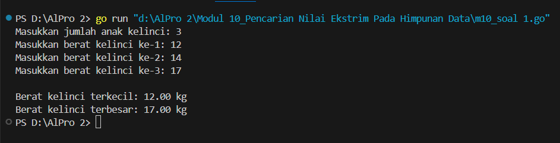

<h1 align="center">Laporan Praktikum Modul 10<br> Pencarian Nilai Ekstrim Pada Himpunan Data </h1>
___
<p align="center">NAFILA SETYANI - 103112430019</p>
___
## Dasar Teori
___
Pencarian nilai ekstrim, yaitu nilai maksimum atau minimum dalam sebuah himpunan data, merupakan salah satu algoritma dasar yang penting dalam pemrograman. Proses ini melibatkan pemeriksaan setiap elemen dalam kumpulan data untuk menentukan nilai tertinggi atau terendah. Teknik ini umumnya dilakukan secara sekuensial, dimulai dengan mengasumsikan elemen pertama sebagai nilai ekstrim sementara, lalu membandingkannya dengan elemen-elemen berikutnya untuk diperbarui jika ditemukan nilai yang lebih ekstrim. Proses ini dapat diterapkan baik pada array bertipe data dasar (seperti integer dan float) maupun array bertipe data terstruktur (seperti struct pada Go). Dalam tipe data terstruktur, tidak hanya nilai ekstrim yang penting, tetapi juga identitas atau posisi data tersebut, seperti nama mahasiswa dengan IPK tertinggi. Oleh karena itu, algoritma pencarian nilai ekstrim dapat dimodifikasi untuk mengembalikan indeks atau informasi lengkap dari elemen yang memiliki nilai ekstrim tersebut. Teknik ini sangat berguna dalam berbagai aplikasi nyata, seperti pengolahan data berat badan, penilaian, ataupun pencatatan statistik.

___
### Soal Latihan Modul 10

##### Soal 1
>Sebuah program digunakan untuk mendata berat anak kelinci yang akan dijual ke pasar. Program ini menggunakan array dengan kapasitas 1000 untuk menampung data berat anak kelinci yang akan dijual. Masukan terdiri dari sekumpulan bilangan, yang mana bilangan pertama adalah bilangan bulat N yang menyatakan banyaknya anak kelinci yang akan ditimbang beratnya. Selanjutnya N bilangan riil berikutnya adalah berat dari anak kelinci yang akan dijual. Keluaran terdiri dari dua buah bilangan riil yang menyatakan berat kelinci terkecil dan terbesar.


```go
package main
import (
    "fmt"
)
const MAX = 1000
type arrKelinci [MAX]float64
// Fungsi untuk mencari berat terkecil dan terbesar
func cariMinMax(data arrKelinci, n int, min *float64, max *float64) {
    *min = data[0]
    *max = data[0]
    for i := 1; i < n; i++ {
        if data[i] < *min {
            *min = data[i]
        }
        if data[i] > *max {
            *max = data[i]
        }
    }
}
func main() {
    var berat arrKelinci
    var n int
    fmt.Print("Masukkan jumlah anak kelinci: ")
    fmt.Scan(&n)
    // Validasi jumlah data tidak melebihi kapasitas
    if n < 1 || n > MAX {
        fmt.Println("Jumlah data tidak valid.")
        return
    }
    // Input berat kelinci
    for i := 0; i < n; i++ {
        fmt.Printf("Masukkan berat kelinci ke-%d: ", i+1)
        fmt.Scan(&berat[i])
    }
    // Cari berat minimum dan maksimum
    var min, max float64
    cariMinMax(berat, n, &min, &max)
    // Tampilkan hasil
    fmt.Printf("\nBerat kelinci terkecil: %.2f kg\n", min)
    fmt.Printf("Berat kelinci terbesar: %.2f kg\n", max)
}
```

> Output
> 
> 

Program di atas dibuat untuk mendata dan mencari berat terkecil serta terbesar dari sekumpulan anak kelinci yang akan dijual ke pasar. Program ini menggunakan array berdimensi tetap dengan kapasitas maksimal 1000 elemen untuk menyimpan data berat kelinci dalam satuan kilogram. Pengguna diminta memasukkan jumlah anak kelinci, kemudian memasukkan berat masing-masing secara berurutan. Setelah seluruh data dimasukkan, program akan memproses data tersebut menggunakan fungsi `cariMinMax` untuk mencari nilai minimum dan maksimum dari elemen array. Hasil akhirnya adalah dua bilangan riil yang menunjukkan berat kelinci paling ringan dan paling berat yang ditampilkan dengan format dua angka di belakang koma. Program ini mengimplementasikan konsep pencarian nilai ekstrim secara sekuensial, di mana setiap elemen dibandingkan satu per satu untuk menentukan nilai terendah dan tertinggi dalam kumpulan data.
___
##### Soal 2
 >Sebuah program digunakan untuk menentukan tarif ikan yang akan dijual ke pasar. Program dijual. ini menggunakan array dengan kapasitas 1000 untuk menampung data berat ikan yang akan Masukan terdiri dari dua baris, yang mana baris pertama terdiri dari dua bilangan bulat x dan y. Bilangan x menyatakan banyaknya ikan yang akan dijual, sedangkan y adalah banyaknya ikan yang akan dimasukan ke dalam wadah. Baris kedua terdiri dari sejumlah x bilangan riil yang menyatakan banyaknya ikan yang akan dijual. Keluaran terdiri dari dua baris. Baris pertama adalah kumpulan bilangan riil yang menyatakan total berat ikan di setiap wadah (jumlah wadah tergantung pada nilai x dan y, urutan ikan yang dimasukan ke dalam wadah sesuai urutan pada masukan baris ke-2). Baris kedua adalah sebuah bilangan riil yang menyatakan berat rata-rata ikan di setiap wadah.
 
```go
package main
import (
    "fmt"
)
const MAX = 1000
type arrIkan [MAX]float64
func main() {
    var x, y int
    var berat arrIkan
    fmt.Print("Masukkan jumlah ikan yang akan dijual (x) dan jumlah ikan per wadah (y): ")
    fmt.Scan(&x, &y)
    if x < 1 || x > MAX || y < 1 {
        fmt.Println("Input tidak valid.")
        return
    }
    fmt.Println("Masukkan berat masing-masing ikan:")
    for i := 0; i < x; i++ {
        fmt.Printf("Berat ikan ke-%d: ", i+1)
        fmt.Scan(&berat[i])
    }
    // Hitung total berat per wadah
    jumlahWadah := (x + y - 1) / y // pembulatan ke atas
    totalPerWadah := make([]float64, jumlahWadah)
    for i := 0; i < x; i++ {
        indexWadah := i / y
        totalPerWadah[indexWadah] += berat[i]
    }
    // Output baris pertama: total berat per wadah
    fmt.Println("\nTotal berat per wadah:")
    for i := 0; i < jumlahWadah; i++ {
        fmt.Printf("%.2f ", totalPerWadah[i])
    }
    // Hitung dan tampilkan rata-rata berat wadah
    var totalSemua float64
    for i := 0; i < jumlahWadah; i++ {
        totalSemua += totalPerWadah[i]
    }
    rataRata := totalSemua / float64(jumlahWadah)
    fmt.Printf("\n\nBerat rata-rata per wadah: %.2f kg\n", rataRata)
}
```

>Output
>
> 

Program ini digunakan untuk menghitung total berat ikan di setiap wadah serta mencari berat rata-rata per wadah berdasarkan data berat ikan yang dimasukkan secara berurutan. Program menerima dua input bilangan bulat: jumlah ikan yang akan dijual (`x`) dan kapasitas ikan per wadah (`y`). Kemudian, pengguna memasukkan berat masing-masing ikan dalam satuan kilogram. Program membagi ikan ke dalam beberapa wadah sesuai urutan, lalu menghitung total berat di setiap wadah. Selanjutnya, program menghitung rata-rata berat dari seluruh wadah yang terbentuk. Konsep pencarian nilai ekstrem diterapkan secara implisit melalui pembagian dan akumulasi data ke dalam kelompok (wadah) untuk kemudian dianalisis total dan reratanya.
___
##### Soal 3
>Pos Pelayanan Terpadu (posyandu) sebagai tempat pelayanan kesehatan perlu mencatat data berat balita (dalam kg). Petugas akan memasukkan data tersebut ke dalam array. Dari data yang diperoleh akan dicari berat balita terkecil, terbesar, dan reratanya. Buatlah program dengan spesifikasi subprogram sebagai berikut:
>


```go
package main

import (
	"fmt"
)

const maxBalita = 100

// Fungsi untuk menghitung nilai minimum dan maksimum
func hitungMinMax(arrBerat []float64, bMin, bMax *float64) {
	if len(arrBerat) == 0 {
		return
	}
	*bMin = arrBerat[0]
	*bMax = arrBerat[0]
	for _, val := range arrBerat[1:] {
		if val < *bMin {
			*bMin = val
		}
		if val > *bMax {
			*bMax = val
		}
	}
}

// Fungsi untuk menghitung rata-rata
func rerata(arrBerat []float64) float64 {
	var total float64
	for _, val := range arrBerat {
		total += val
	}
	return total / float64(len(arrBerat))
}

func main() {
	var n int
	var berat [maxBalita]float64

	fmt.Print("Masukan banyak data berat balita : ")
	fmt.Scan(&n)

	for i := 0; i < n; i++ {
		fmt.Printf("Masukan berat balita ke-%d: ", i+1)
		fmt.Scan(&berat[i])
	}

	// Konversi array menjadi slice
	data := berat[:n]

	var min, max float64
	hitungMinMax(data, &min, &max)
	rata := rerata(data)

	fmt.Printf("Berat balita minimum: %.2f kg\n", min)
	fmt.Printf("Berat balita maksimum: %.2f kg\n", max)
	fmt.Printf("Rerata berat balita: %.2f kg\n", rata)
}
```

>Output
>

Program ini digunakan oleh petugas Posyandu untuk mencatat dan mengolah data berat balita dalam satu sesi. Program akan membaca sejumlah berat balita yang dimasukkan ke dalam array. Selanjutnya, dua subprogram digunakan: satu untuk menghitung nilai minimum dan maksimum dari data (fungsi `hitungMinMax`), dan satu lagi untuk menghitung rata-rata berat balita (`rerata`). Proses ini merupakan contoh penerapan pencarian nilai ekstrem (minimum dan maksimum) dalam himpunan data numerik.
___

