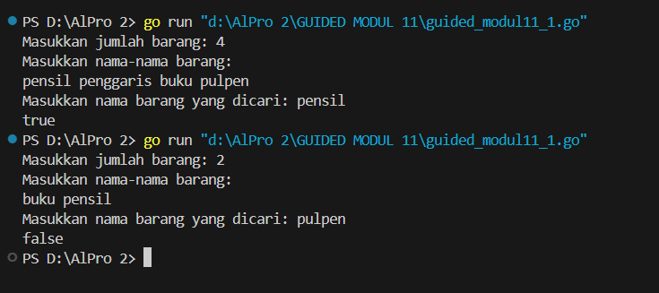
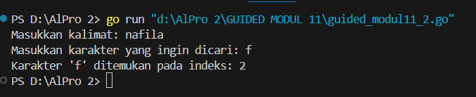
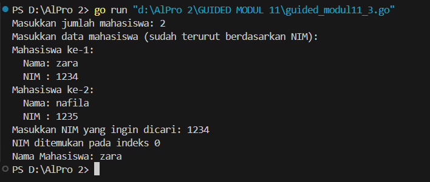
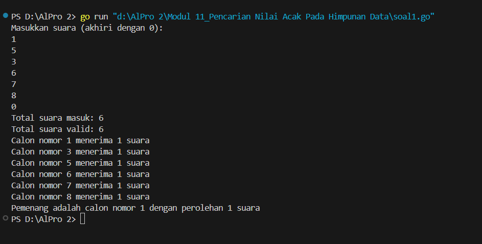
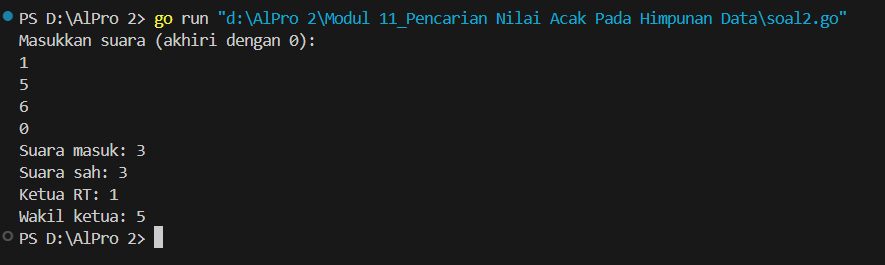
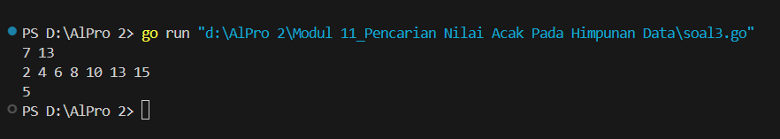

<h1 align="center">Laporan Praktikum Modul 11 <br>Nilai Acak Pada Himpunan Data</h1>
<p align="center">NAFILA SETYANI - 103112430019</p>

## Dasar Teori
Tidak seperti pencarian nilai maksimum atau minimum yang hasilnya selalu ada, dalam metode pencarian ini bisa saja elemen yang dicari tidak ditemukan di dalam kumpulan data. Pada jenis pencarian ini juga dikenalkan pendekatan yang memanfaatkan keteraturan susunan data, seperti **Pencarian Berurutan** yang memeriksa elemen demi elemen dari awal hingga akhir, serta **Pencarian Biner** yang memanfaatkan proses pembagian data yang sudah tersusun secara menaik untuk mempercepat pencarian. Sementara itu, pada array yang berisi data bertipe struct, pencarian dilakukan dengan cara serupa, namun perlu menentukan atribut atau bagian data mana yang akan dijadikan dasar pencarian.

## Guided
#### Soal 1
```go
package main
import "fmt"

func cariBarang(daftar []string, x string) bool {
    for _, barang := range daftar {
        if barang == x {
            return true
        }
    }
    return false
}
  
func main() {
    var n int
    fmt.Print("Masukkan jumlah barang: ")
    fmt.Scan(&n)
  
    daftarBarang := make([]string, n)
    fmt.Println("Masukkan nama-nama barang:")
    for i := 0; i < n; i++ {
        fmt.Scan(&daftarBarang[i])
    }
  
    var barangDicari string
    fmt.Print("Masukkan nama barang yang dicari: ")
    fmt.Scan(&barangDicari)

    ditemukan := cariBarang(daftarBarang, barangDicari)
    fmt.Println(ditemukan)
}
```


Program Go di atas dibuat untuk **memeriksa keberadaan suatu item dalam list** barang yang diinput oleh user.  
Fungsi akan memeriksa setiap elemen dalam slice secara berurutan. Jika terdapat item yang cocok dengan nilai _x_, maka fungsi akan mengembalikan hasil berupa _true_. Namun, jika seluruh elemen telah diperiksa dan tidak ditemukan kecocokan, maka yang dikembalikan adalah _false_.
#### Soal 2
```go
package main

import (
    "bufio"
    "fmt"
    "os"
    "strings"
)

func printPositions(karakter string, posisi []int) {
    if len(posisi) > 0 {
        fmt.Printf("Karakter '%s' ditemukan pada indeks: %s\n", karakter, strings.Trim(strings.Join(strings.Fields(fmt.Sprint(posisi)), ","), "[]"))
    } else {
        fmt.Printf("Karakter '%s' tidak ditemukan dalam kalimat.\n", karakter)
    }
}

func main() {
    var karakter string
    reader := bufio.NewReader(os.Stdin)

    fmt.Print("Masukkan kalimat: ")
    kalimat, _ := reader.ReadString('\n')
    kalimat = strings.TrimSpace(kalimat)

    fmt.Print("Masukkan karakter yang ingin dicari: ")
    fmt.Scanln(&karakter)

    if len(karakter) != 1 {
        fmt.Println("Harap masukkan satu karakter saja.")
        return
    }

    var posisi []int
    for i, c := range kalimat {
        if string(c) == karakter {
            posisi = append(posisi, i)
        }
    }
    printPositions(karakter, posisi)
}
```

Program ini dirancang untuk **menemukan seluruh posisi (indeks)** dari sebuah karakter yang dimasukkan oleh pengguna dalam sebuah kalimat, lalu menampilkan semua lokasi kemunculannya. Fungsi `printPositions` bertugas menampilkan hasil pencarian tersebut: jika karakter ditemukan, program akan mencetak seluruh indeks tempat karakter muncul; jika tidak ditemukan, akan ditampilkan pesan bahwa karakter tidak ada dalam kalimat. Untuk memastikan input dapat memuat kalimat lengkap termasuk spasi, digunakan `bufio.NewReader`, sementara `TrimSpace` berfungsi untuk menghapus karakter newline atau spasi yang tidak diperlukan di akhir input.
#### Soal 3
```go
package main
import "fmt"

type Mahasiswa struct {
    Nama string
    NIM  string
}

func binarySearch(mahasiswa []Mahasiswa, target string) int {
    low := 0
    high := len(mahasiswa) - 1
    for low <= high {
        mid := (low + high) / 2
        if mahasiswa[mid].NIM == target {
            return mid
        } else if mahasiswa[mid].NIM < target {
            low = mid + 1
        } else {
            high = mid - 1
        }
    }
    return -1
}

func main() {
    var n int
    fmt.Print("Masukkan jumlah mahasiswa: ")
    fmt.Scanln(&n)
    mahasiswa := make([]Mahasiswa, n)

    fmt.Println("Masukkan data mahasiswa (sudah terurut berdasarkan NIM):")
    for i := 0; i < n; i++ {
        fmt.Printf("Mahasiswa ke-%d:\n", i+1)
        fmt.Print("  Nama: ")
        fmt.Scanln(&mahasiswa[i].Nama)
        fmt.Print("  NIM : ")
        fmt.Scanln(&mahasiswa[i].NIM)
    }
    var cariNIM string
    fmt.Print("Masukkan NIM yang ingin dicari: ")
    fmt.Scanln(&cariNIM)
    indeks := binarySearch(mahasiswa, cariNIM)

    if indeks != -1 {
        fmt.Printf("NIM ditemukan pada indeks %d\n", indeks)
        fmt.Printf("Nama Mahasiswa: %s\n", mahasiswa[indeks].Nama)
    } else {
        fmt.Println("NIM tidak ditemukan.")
    }
}
```

Program ini digunakan untuk mencari data mahasiswa berdasarkan **NIM** menggunakan metode **Binary Search**.
Fungsi binarySearch ini digunakan untuk mencari NIM mahasiswa menggunakan algoritma pencarian biner, yang sangat efisien untuk data yang sudah terurut.
## Unguided

### Soal Latihan Modul 10

#### Soal 1
>Pada pemilihan ketua RT yang baru saja berlangsung, terdapat 20 calon ketua yang bertanding memperebutkan suara warga. Perhitungan suara dapat segera dilakukan karena warga cukup mengisi formulir dengan nomor dari calon ketua RT yang dipilihnya. Seperti biasa, selalu ada pengisian yang tidak tepat atau dengan nomor pilihan di luar yang tersedia, sehingga data juga harus divalidasi. Tugas Anda untuk membuat program mencari siapa yang memenangkan pemilihan ketua RT. Buatlah program pilkart yang akan membaca, memvalidasi, dan menghitung suara yang diberikan dalam pemilihan ketua RT tersebut. 
>Masukan hanya satu baris data saja, berisi bilangan bulat valid yang kadang tersisipi dengan data tidak valid. Data valid adalah integer dengan nilai di antara 1 s.d. 20 (inklusif). Data berakhir jika ditemukan sebuah bilangan dengan nilai 0. 
>Keluaran dimulai dengan baris berisi jumlah data suara yang terbaca, diikuti baris yang berisi berapa banyak suara yang valid. Kemudian sejumlah baris yang mencetak data para calon apa saja yang mendapatkan suara.
```go
package main

  

import (

    "fmt"

)

  

func main() {

    var suaraMasuk, jumlahMasuk, jumlahValid int

    votes := make([]int, 21)

  

    fmt.Println("Masukkan suara (akhiri dengan 0):")

    for {

        fmt.Scan(&suaraMasuk)

        if suaraMasuk == 0 {

            break

        }

        jumlahMasuk++

        if suaraMasuk >= 1 && suaraMasuk <= 20 {

            votes[suaraMasuk]++

            jumlahValid++

        }

    }

  

    kandidatTeratas := 0

    suaraTertinggi := -1

  

    for nomor := 1; nomor <= 20; nomor++ {

        if votes[nomor] > suaraTertinggi {

            suaraTertinggi = votes[nomor]

            kandidatTeratas = nomor

        }

    }

  

    fmt.Println("Total suara masuk:", jumlahMasuk)

    fmt.Println("Total suara valid:", jumlahValid)

    for nomor := 1; nomor <= 20; nomor++ {

        if votes[nomor] > 0 {

            fmt.Printf("Calon nomor %d menerima %d suara\n", nomor, votes[nomor])

        }

    }

  

    if kandidatTeratas > 0 {

        fmt.Printf("Pemenang adalah calon nomor %d dengan perolehan %d suara\n", kandidatTeratas, suaraTertinggi)

    } else {

        fmt.Println("Belum ada suara valid yang masuk, tidak ada pemenang.")

    }

}
```


Program ini berfungsi untuk menghitung dan menampilkan hasil pemungutan suara dari 20 calon yang berbeda. Pengguna akan diminta memasukkan angka-angka yang mewakili nomor calon, dan input akan dihentikan saat angka 0 dimasukkan. Setiap angka yang berada dalam rentang 1 hingga 20 dianggap sebagai suara yang valid dan akan dihitung untuk calon tersebut. Program mencatat total suara yang masuk, jumlah suara yang valid, dan menghitung berapa suara yang diterima oleh masing-masing calon. Setelah semua suara diproses, program menampilkan rincian jumlah suara total, suara valid, serta jumlah suara yang diperoleh setiap calon yang mendapatkan suara. Terakhir, program menentukan calon yang mendapatkan suara terbanyak dan menampilkannya sebagai pemenang. Jika tidak ada satu pun suara valid yang diterima, maka program akan menampilkan pesan bahwa tidak ada pemenang.
#### Soal 2
) Berdasarkan program sebelumnya, buat program pilkart yang mencari siapa pemenang pemilihan ketua RT. Sekaligus juga ditentukan bahwa wakil ketua RT adalah calon yang mendapatkan suara terbanyak kedua. Jika beberapa calon mendapatkan suara terbanyak yang sama, ketua terpilih adalah dengan nomor peserta yang paling kecil dan wakilnya dengan nomor peserta terkecil berikutnya. 
Masukan hanya satu baris data saja, berisi bilangan bulat valid yang kadang tersisipi dengan data tidak valid. Data valid adalah bilangan bulat dengan nilai di antara 1 s.d. 20 (inklusif). Data berakhir jika ditemukan sebuah bilangan dengan nilai 0. 
Keluaran dimulai dengan baris berisi jumlah data suara yang terbaca, diikuti baris yang berisi berapa banyak suara yang valid. Kemudian tercetak calon nomor berapa saja yang menjadi pasangan ketua RT dan wakil ketua RT yang baru.
```go
package main

import "fmt"

func main() {
	var suaraMasuk, jumlahSuara, jumlahValid int
	daftarSuara := make([]int, 21)

	fmt.Println("Masukkan suara (akhiri dengan 0):")
	for {
		fmt.Scan(&suaraMasuk)
		if suaraMasuk == 0 {
			break
		}
		jumlahSuara++
		if suaraMasuk >= 1 && suaraMasuk <= 20 {
			daftarSuara[suaraMasuk]++
			jumlahValid++
		}
	}

	pilihanUtama := 0
	pilihanKedua := 0

	for kandidat := 1; kandidat <= 20; kandidat++ {
		if daftarSuara[kandidat] > daftarSuara[pilihanUtama] || (daftarSuara[kandidat] == daftarSuara[pilihanUtama] && kandidat < pilihanUtama) {
			pilihanKedua = pilihanUtama
			pilihanUtama = kandidat
		} else if (daftarSuara[kandidat] > daftarSuara[pilihanKedua] || (daftarSuara[kandidat] == daftarSuara[pilihanKedua] && kandidat < pilihanKedua)) && kandidat != pilihanUtama {
			pilihanKedua = kandidat
		}
	}

	fmt.Printf("Suara masuk: %d\n", jumlahSuara)
	fmt.Printf("Suara sah: %d\n", jumlahValid)
	if jumlahValid == 0 {
		fmt.Println("Tidak ada suara sah.")
	} else {
		fmt.Printf("Ketua RT: %d\n", pilihanUtama)
		if daftarSuara[pilihanKedua] > 0 {
			fmt.Printf("Wakil ketua: %d\n", pilihanKedua)
		} else {
			fmt.Println("Wakil ketua: tidak ada.")
		}
	}
}

```

Program ini digunakan untuk merekap dan menentukan hasil pemilihan Ketua dan Wakil Ketua RT berdasarkan suara yang dimasukkan oleh pengguna. Pengguna diminta untuk memasukkan nomor calon (1–20), dan proses input akan berhenti ketika angka 0 dimasukkan. Setiap angka yang valid akan dihitung sebagai suara sah, lalu program akan menghitung total suara masuk, suara sah, dan menyimpan jumlah suara untuk masing-masing calon. Setelah semua data dikumpulkan, program akan mencari calon dengan suara terbanyak sebagai Ketua, dan calon dengan suara terbanyak kedua (yang bukan Ketua) sebagai Wakil Ketua. Hasil pemilihan ditampilkan ke layar, termasuk informasi apakah ada Wakil Ketua atau tidak jika hanya satu calon yang mendapatkan suara.
#### Soal 3
Diberikan n data integer positif dalam keadaan terurut membesar dan sebuah integer lain k, apakah bilangan k tersebut ada dalam daftar bilangan yang diberikan? Jika ya, berikan indeksnya, jika tidak sebutkan "TIDAK ADA". 
Masukan terdiri dari dua baris. Baris pertama berisi dua buah integer positif, yaitu n dan k. n menyatakan banyaknya data, dimana 1 < n <= 1000000. k adalah bilangan yang ingin dicari. Baris kedua berisi n buah data integer positif yang sudah terurut membesar. 
Keluaran terdiri dari satu baris saja, yaitu sebuah bilangan yang menyatakan posisi data yang dicari (k) dalam kumpulan data yang diberikan. Posisi data dihitung dimulai dari angka 0. Atau memberikan keluaran "TIDAK ADA" jika data k tersebut tidak ditemukan dalam kumpulan. Program yang dibangun harus menggunakan subprogram dengan mengikuti kerangka yang sudah diberikan berikut ini.
```go
package main
import "fmt"
func cariDenganBinary(slice []int, target int) int {
    start := 0
    end := len(slice) - 1
    for start <= end {
        tengah := (start + end) / 2
        if slice[tengah] == target {
            return tengah
        } else if slice[tengah] < target {
            start = tengah + 1
        } else {
            end = tengah - 1
        }
    }
    return -1
}
func main() {
    var jumlahData, angkaDicari int
    fmt.Scan(&jumlahData, &angkaDicari)
    urutan := make([]int, jumlahData)
    for indeks := 0; indeks < jumlahData; indeks++ {
        fmt.Scan(&urutan[indeks])
    }
    hasil := cariDenganBinary(urutan, angkaDicari)
    if hasil != -1 {
        fmt.Println(hasil)
    } else {
        fmt.Println("TIDAK ADA")
    }
}
```

Program ini merupakan implementasi dari algoritma _binary search_ untuk mencari sebuah nilai dalam kumpulan data yang telah diurutkan secara menaik. Pengguna diminta untuk memasukkan jumlah elemen data dan angka yang ingin dicari, lalu memasukkan deretan angka yang akan dijadikan tempat pencarian. Program kemudian memproses pencarian menggunakan pendekatan binary search, yaitu dengan membandingkan nilai di tengah data dengan nilai yang dicari. Jika nilai tersebut sesuai, maka indeks dikembalikan; jika tidak, pencarian dilanjutkan di setengah bagian data yang relevan. Apabila angka ditemukan, program akan mencetak posisi indeksnya, sedangkan jika tidak ditemukan, maka akan menampilkan pesan "TIDAK ADA". Program ini efisien untuk data yang sudah terurut karena mengurangi jumlah perbandingan secara signifikan dibanding pencarian linear.


