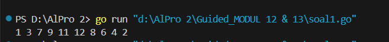
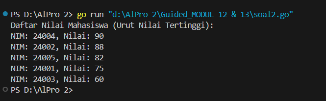
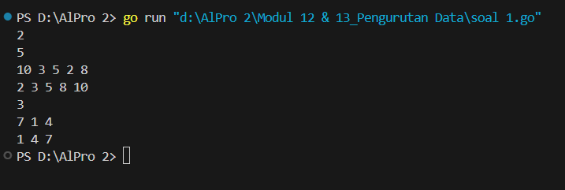
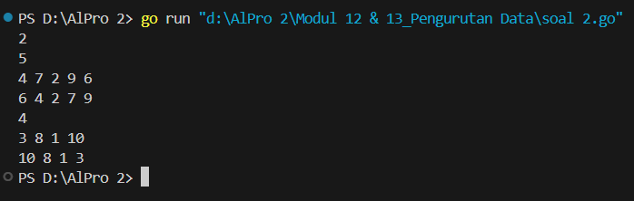
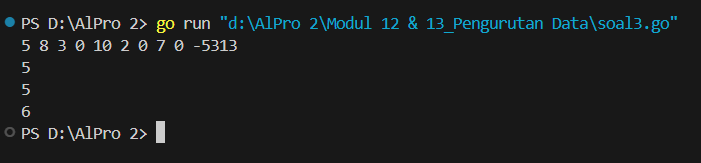
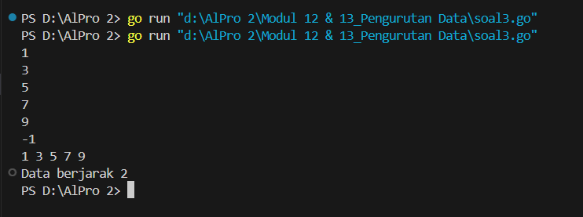
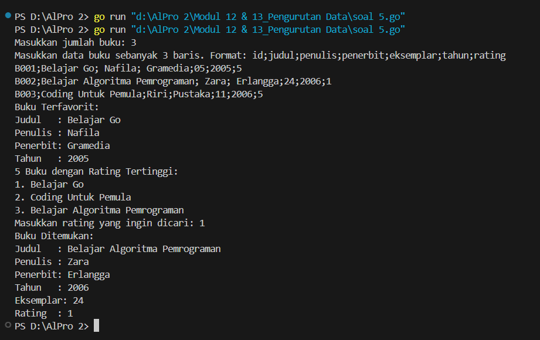

<h1 align="center">Laporan Praktikum Modul 12 & 13 <br>Pengurutan Data</h1>
<p align="center">NAFILA SETYANI - 103112430019</p>

## Dasar Teori
Algoritma _Selection Sort_ adalah metode pengurutan sederhana yang bekerja dengan cara menyeleksi elemen terkecil (atau terbesar) dari kumpulan data yang belum diurutkan, kemudian menukarnya dengan elemen pada posisi saat ini. Proses ini diulang hingga seluruh data terurut. Ide dasarnya adalah mencari _nilai ekstrem_ (minimum untuk ascending atau maksimum untuk descending) dari bagian array yang belum terurut, kemudian melakukan _pertukaran (swap)_ dengan elemen di posisi awal dari bagian tersebut. Dalam setiap iterasi, jumlah data yang belum terurut berkurang satu karena satu elemen telah ditempatkan pada posisi yang benar. Algoritma ini memiliki dua proses utama: pencarian indeks nilai ekstrem dan proses pertukaran. Meski sederhana dan mudah diimplementasikan, selection sort memiliki kompleksitas waktu O(n²), sehingga kurang efisien untuk dataset besar.
## Guided
#### Soal 1
Urut Ganjil Genap
Diberikan `n` bilangan bulat positif. Buat program untuk mengurutkan angka ganjil secara **membesar (ascending)** dan angka genap secara **mengecil (descending)**, lalu gabungkan hasilnya dengan ganjil duluan.
Gunakan **selection sort** dalam proses pengurutan.
**Masukan:**
- Baris pertama berisi bilangan bulat `n` (1 ≤ n ≤ 100).
- Baris kedua berisi `n` bilangan bulat positif.
**Keluaran:**
- Satu baris berisi angka ganjil terurut membesar diikuti angka genap terurut mengecil.
**Contoh Masukan:**
```
10
12 7 3 2 9 6 8 1 11 4
```
**Contoh Keluaran:**
```
1 3 7 9 11 12 8 6 4 2
```

```go
package main
import "fmt"
func selectionSortAsc(arr []int, panjang int) {
    var temp, i, j, idxMin int
    for i = 0; i < panjang-1; i++ {
        idxMin = i
        for j = i + 1; j < panjang; j++ {
            if arr[j] < arr[idxMin] {
                idxMin = j
            }
        }
        temp = arr[idxMin]
        arr[idxMin] = arr[i]
        arr[i] = temp
    }
}
func selectionSortDesc(arr []int, panjang int) {
    var temp, i, j, idxMax int
    for i = 0; i < panjang-1; i++ {
        idxMax = i
        for j = i + 1; j < panjang; j++ {
            if arr[j] > arr[idxMax] {
                idxMax = j
            }
        }
        temp = arr[idxMax]
        arr[idxMax] = arr[i]
        arr[i] = temp
    }
}

func main() {
    n := 10
    numbers := []int{12, 7, 3, 2, 9, 6, 8, 1, 11, 4}
    var ganjil []int
    var genap []int
    for i := 0; i < n; i++ {
        if numbers[i]%2 == 1 {
            ganjil = append(ganjil, numbers[i])
        } else {
            genap = append(genap, numbers[i])
        }
    }
    selectionSortAsc(ganjil, len(ganjil))
    selectionSortDesc(genap, len(genap))
    for i := 0; i < len(ganjil); i++ {
        fmt.Print(ganjil[i], " ")
    }
    for i := 0; i < len(genap); i++ {
        fmt.Print(genap[i], " ")
    }
}
```
> 

Kode program Go di atas mengimplementasikan algoritma _selection sort_ untuk mengurutkan bilangan ganjil secara menaik (ascending) dan bilangan genap secara menurun (descending) dari sebuah array. Program dimulai dengan mendefinisikan dua fungsi: `selectionSortAsc` untuk mengurutkan array secara menaik, dan `selectionSortDesc` untuk mengurutkan array secara menurun. Di fungsi `main`, sebuah array `numbers` berisi 10 bilangan dipisahkan menjadi dua array terpisah, yaitu `ganjil` untuk bilangan ganjil dan `genap` untuk bilangan genap. Setelah pemisahan, array `ganjil` diurutkan menggunakan `selectionSortAsc`, sedangkan `genap` diurutkan dengan `selectionSortDesc`. Hasil akhirnya adalah mencetak bilangan ganjil yang sudah diurutkan dari kecil ke besar, diikuti oleh bilangan genap dari besar ke kecil.
#### Soal 2
Ranking Nilai Ujian
Sebuah kelas memiliki sejumlah siswa yang telah mengikuti ujian. Tugas Anda adalah membuat program yang membaca nilai-nilai ujian siswa dengan struct berisikan `nim` dan `nilai`, lalu mengurutkannya dari yang tertinggi ke yang terendah menggunakan **insertion sort**.
**Masukan:**
- Baris pertama adalah sebuah bilangan bulat `n` (1 ≤ n ≤ 100), menyatakan jumlah siswa.
- Baris berikutnya berisi `n` bilangan bulat yang masing-masing adalah nilai ujian (0–100).
**Keluaran:**
- Satu baris berisi nilai-nilai yang sudah terurut dari terbesar ke terkecil.
**Contoh Masukan:**
```
6
75 60 90 80 100 65
```
**Contoh Keluaran:**
```
100 90 80 75 65 60
```

```go
package main
import (
    "fmt"
)
type Mahasiswa struct {
    NIM   string
    Nilai int
}
func insertionSortDescending(data []Mahasiswa) {
    for i := 1; i < len(data); i++ {
        key := data[i]
        j := i - 1
        for j >= 0 && data[j].Nilai < key.Nilai {
            data[j+1] = data[j]
            j--
        }
        data[j+1] = key
    }
}
func main() {
    // Contoh input data mahasiswa
    siswa := []Mahasiswa{

        {"24001", 75},

        {"24002", 88},

        {"24003", 60},

        {"24004", 90},

        {"24005", 82},
    }

    insertionSortDescending(siswa)

    fmt.Println("Daftar Nilai Mahasiswa (Urut Nilai Tertinggi):")
    for _, m := range siswa {
        fmt.Printf("NIM: %s, Nilai: %d\n", m.NIM, m.Nilai)
    }
}
```
> 

Kode Go (Golang) di atas merupakan program untuk **mengurutkan data mahasiswa berdasarkan nilai secara menurun (descending)** menggunakan algoritma **Insertion Sort**. Struct `Mahasiswa` menyimpan data NIM dan nilai. Fungsi `insertionSortDescending` menjalankan logika insertion sort dengan membandingkan nilai dan menggeser elemen yang lebih kecil ke kanan hingga posisi yang tepat untuk `key` ditemukan. Dalam `main()`, terdapat slice berisi data mahasiswa yang kemudian diurutkan, dan hasilnya ditampilkan dalam urutan dari nilai tertinggi ke terendah.

## Unguided

### Soal Latihan Modul 12 & 13

#### Soal 1
>Hercules, preman terkenal seantero ibukota, memiliki kerabat di banyak daerah. Tentunya Hercules sangat suka mengunjungi semua kerabatnya itu. Diberikan masukan nomor rumah dari semua kerabatnya di suatu daerah, buatlah program rumahkerabat yang akan menyusun nomor-nomor rumah kerabatnya secara terurut membesar menggunakan algoritma selection sort. Masukan dimulai dengan sebuah integer 𝒏 (0 < n < 1000), banyaknya daerah kerabat Hercules tinggal. Isi 𝒏 baris berikutnya selalu dimulai dengan sebuah integer 𝒎 (0 < m < 1000000) yang menyatakan banyaknya rumah kerabat di daerah tersebut, diikuti dengan rangkaian bilangan bulat positif, nomor rumah para kerabat. 
>Keluaran terdiri dari n baris, yaitu rangkaian rumah kerabatnya terurut membesar di masing masing daerah.

```go
package main
import "fmt"
func urutSelection(data []int) {
    panjang := len(data)
    for awal := 0; awal < panjang-1; awal++ {
        indeksTerkecil := awal
        for berikutnya := awal + 1; berikutnya < panjang; berikutnya++ {
            if data[berikutnya] < data[indeksTerkecil] {
                indeksTerkecil = berikutnya
            }
        }
        data[awal], data[indeksTerkecil] = data[indeksTerkecil], data[awal]
    }
}
func main() {
    var jumlahTestcase int
    fmt.Scan(&jumlahTestcase)
    for t := 0; t < jumlahTestcase; t++ {
        var jumlahRumah int
        fmt.Scan(&jumlahRumah)
        daftarRumah := make([]int, jumlahRumah)
        for k := 0; k < jumlahRumah; k++ {
            fmt.Scan(&daftarRumah[k])
        }
        urutSelection(daftarRumah)
        for _, nilai := range daftarRumah {
            fmt.Printf("%d ", nilai)
        }
        fmt.Println()
    }
}
```
> 

Program di atas ditulis dalam bahasa Go dan berfungsi untuk mengurutkan sejumlah data bilangan bulat dalam beberapa kasus (test case) menggunakan algoritma _selection sort_. Pertama, program membaca sebuah bilangan `n` yang menyatakan jumlah test case. Untuk setiap test case, program membaca sebuah bilangan `m` yang menunjukkan jumlah elemen dalam array, lalu membaca `m` bilangan bulat dan menyimpannya dalam slice `rumah`. Slice tersebut kemudian diurutkan menggunakan fungsi `selectionSort`, yang bekerja dengan mencari elemen terkecil dari sisa array dan menukarnya ke posisi yang sesuai. Setelah proses pengurutan selesai, hasil array yang telah terurut ditampilkan di layar dalam satu baris per test case. Program ini memastikan setiap kumpulan data rumah ditampilkan dalam urutan menaik (ascending).
#### Soal 2
Belakangan diketahui ternyata Hercules itu tidak berani menyeberang jalan, maka selalu diusahakan agar hanya menyeberang jalan sesedikit mungkin, hanya diujung jalan. Karena nomor rumah sisi kiri jalan selalu ganjil dan sisi kanan jalan selalu genap, maka buatlah program kerabat dekat yang akan menampilkan nomor rumah mulai dari nomor yang ganjil lebih dulu terurut membesar dan kemudian menampilkan nomor rumah dengan nomor genap terurut mengecil. Format Masukan masih persis sama seperti sebelumnya. 
Keluaran terdiri dari n baris, yaitu rangkaian rumah kerabatnya terurut membesar untuk nomor ganjil, diikuti dengan terurut mengecil untuk nomor genap, di masing-masing daerah.

```go
package main

import "fmt"

// Fungsi untuk mengurutkan slice secara menurun
func urutTurun(data []int) {
    for i := range data {
        indeksMaks := i
        for j := i + 1; j < len(data); j++ {
            if data[j] > data[indeksMaks] {
                indeksMaks = j
            }
        }
        data[i], data[indeksMaks] = data[indeksMaks], data[i]
    }
}

// Fungsi untuk mengurutkan slice secara naik
func urutNaik(data []int) {
    for i := 0; i < len(data)-1; i++ {
        indeksMin := i
        for j := i + 1; j < len(data); j++ {
            if data[j] < data[indeksMin] {
                indeksMin = j
            }
        }
        data[i], data[indeksMin] = data[indeksMin], data[i]
    }
}

func main() {
    var kasus int
    fmt.Scan(&kasus)

    for x := 0; x < kasus; x++ {
        var jumlah int
        fmt.Scan(&jumlah)

        bilGenap := []int{}
        bilGanjil := []int{}

        for i := 0; i < jumlah; i++ {
            var nilai int
            fmt.Scan(&nilai)
            if nilai%2 == 0 {
                bilGenap = append(bilGenap, nilai)
            } else {
                bilGanjil = append(bilGanjil, nilai)
            }
        }

        urutTurun(bilGenap)
        urutNaik(bilGanjil)

        for _, g := range bilGenap {
            fmt.Printf("%d ", g)
        }
        for _, h := range bilGanjil {
            fmt.Printf("%d ", h)
        }
        fmt.Println()
    }
}

```
> 

Program ini membaca beberapa kasus (input `n`) di mana tiap kasus terdiri dari sejumlah bilangan bulat. Setiap bilangan dipisahkan menjadi dua kelompok: bilangan genap dan bilangan ganjil. Kelompok bilangan genap kemudian diurutkan secara **menurun (descending)**, sedangkan bilangan ganjil diurutkan secara **menaik (ascending)** menggunakan metode selection sort. Setelah pengurutan selesai, program mencetak bilangan genap terlebih dahulu, diikuti dengan bilangan ganjil dalam satu baris untuk tiap kasus. Proses ini diulang sesuai jumlah kasus yang dimasukkan.

#### Soal 3
Kompetisi pemrograman yang baru saja berlalu diikuti oleh 17 tim dari berbagai perguruan tinggi ternama. Dalam kompetisi tersebut, setiap tim berlomba untuk menyelesaikan sebanyak mungkin problem yang diberikan. Dari 13 problem yang diberikan, ada satu problem yang menarik. Problem tersebut mudah dipahami, hampir semua tim mencoba untuk menyelesaikannya, tetapi hanya 3 tim yang berhasil. Apa sih problemnya? "Median adalah nilai tengah dari suatu koleksi data yang sudah terurut. Jika jumlah data genap, maka nilai median adalah rerata dari kedua nilai tengahnya. Pada problem ini, semua data merupakan bilangan bulat positif, dan karenanya rerata nilai tengah dibulatkan ke bawah." Buatlah program median yang mencetak nilai median terhadap seluruh data yang sudah terbaca, jika data yang dibaca saat itu adalah 0. 
Masukan berbentuk rangkaian bilangan bulat. Masukan tidak akan berisi lebih dari 1000000 data, tidak termasuk bilangan 0. Data 0 merupakan tanda bahwa median harus dicetak, tidak termasuk data yang dicari mediannya. Data masukan diakhiri dengan bilangan bulat -5313. 
Keluaran adalah median yang diminta, satu data per baris.

```go
package main

import (
	"bufio"
	"fmt"
	"os"
	"sort"
	"strconv"
)

// Fungsi untuk menghitung median dari slice bilangan bulat
func hitungMedian(angka []int) int {
	sort.Ints(angka)
	jumlah := len(angka)

	if jumlah == 0 {
		return 0
	}

	tengah := jumlah / 2
	if jumlah%2 == 1 {
		return angka[tengah]
	}
	return (angka[tengah-1] + angka[tengah]) / 2
}

func main() {
	input := bufio.NewScanner(os.Stdin)
	input.Split(bufio.ScanWords)

	var kumpulanAngka []int

	for input.Scan() {
		text := input.Text()
		masukan, err := strconv.Atoi(text)
		if err != nil {
			continue
		}

		switch {
		case masukan == -5313:
			return
		case masukan == 0:
			fmt.Println(hitungMedian(kumpulanAngka))
		case masukan > 0:
			kumpulanAngka = append(kumpulanAngka, masukan)
		}
	}
}

```



Program ini membaca serangkaian angka dari input dan menghitung median setiap kali angka `0` dimasukkan. Setelah membaca beberapa angka positif, program akan mengurutkan angka-angka tersebut dan menghitung median. Median dihitung dengan cara mencari angka tengah jika jumlah data ganjil, atau rata-rata dari dua angka tengah jika jumlah data genap. Proses ini diulang setiap kali angka `0` dimasukkan. Program berhenti ketika angka `-5313` dimasukkan. Sebagai contoh, untuk input `5 8 3 0 10 2 0 7 0 -5313`, output yang dihasilkan adalah `5`, `5`, dan `6`, yang merupakan median dari angka yang dimasukkan setelah setiap `0` ditemukan.

#### Soal 4
Buatlah sebuah program yang digunakan untuk membaca data integer seperti contoh yang diberikan di bawah ini, kemudian diurutkan (menggunakan metoda insertion sort), dan memeriksa apakah data yang terurut berjarak sama terhadap data sebelumnya. 
Masukan terdiri dari sekumpulan bilangan bulat yang diakhiri oleh bilangan negatif. Hanya bilangan non negatif saja yang disimpan ke dalam array. 
Keluaran terdiri dari dua baris. Baris pertama adalah isi dari array setelah dilakukan pengurutan, sedangkan baris kedua adalah status jarak setiap bilangan yang ada di dalam array. "Data berjarak x" atau "data berjarak tidak tetap".

```go
package main
import (
    "bufio"
    "fmt"
    "os"
    "strconv"
)
func insertionSort(arr []int) {
    for i := 0; i < len(arr); i++ {
        key := arr[i]
        j := i - 1
        for j >= 0 && arr[j] > key {
            arr[j+1] = arr[j]
            j--
        }
        arr[j+1] = key
    }
}
func cekJarak(arr []int) (bool, int) {
    if len(arr) < 2 {
        return true, 0
    }
    jarak := arr[len(arr)-1] - arr[len(arr)-2]
    for i := 0; i < len(arr)-1; i++ {
        if arr[i+1]-arr[i] != jarak {
            return false, 0
        }
    }
    return true, jarak
}
func main() {
    var data []int
    input := bufio.NewScanner(os.Stdin)
    for input.Scan() {
        n, err := strconv.Atoi(input.Text())
        if err != nil {
            continue
        }
        if n < 0 {
            break
        }
        data = append(data, n)
    }
    insertionSort(data)
    for _, value := range data {
        fmt.Print(value, " ")
    }
    fmt.Println()
    sama, jarak := cekJarak(data)
    if sama {
        fmt.Printf("Data berjarak %d\n", jarak)
    } else {
        fmt.Println("Data berjarak tidak tetap")
    }
}

```

Pada program ini, input terdiri dari sejumlah angka yang dimasukkan oleh pengguna, diakhiri dengan angka negatif (dalam hal ini `-1`) untuk menghentikan input. Setelah itu, program akan mengurutkan angka-angka tersebut menggunakan algoritma _insertion sort_. Setelah diurutkan, program akan memeriksa apakah selisih antara setiap angka dalam urutan tersebut tetap sama. Dalam contoh di atas, angka yang telah diurutkan adalah `[2, 3, 4, 5, 6, 8]`, dan selisih antara setiap elemen berturut-turut adalah 1, yang berarti data memiliki jarak tetap antara elemen-elemen tersebut. Oleh karena itu, program menampilkan "Data berjarak 1". Jika jarak antar elemen tidak tetap, program akan menampilkan "Data berjarak tidak tetap".
#### Soal 5
Sebuah program perpustakaan digunakan untuk mengelola data buku di dalam suatu perpustakaan.
Masukan terdiri dari beberapa baris. Baris pertama adalah bilangan bulat N yang menyatakan banyaknya data buku yang ada di dalam perpustakaan. N baris berikutnya, masing-masingnya adalah data buku sesuai dengan atribut atau field pada struct. Baris terakhir adalah bilangan bulat yang menyatakan rating buku yang akan dicari. 
Keluaran terdiri dari beberapa baris. Baris pertama adalah data buku terfavorit, baris kedua adalah lima judul buku dengan rating tertinggi, selanjutnya baris terakhir adalah data buku yang dicari sesuai rating yang diberikan pada masukan baris terakhir.

```go
package main

import (
	"bufio"
	"fmt"
	"os"
	"strconv"
	"strings"
)

type Buku struct {
	id, judul, penulis, penerbit string
	eksemplar, tahun, rating     int
}

const nMax = 7919
type DaftarBuku = []Buku

func DaftarkanBuku(pustaka *DaftarBuku, n int) {
	scanner := bufio.NewScanner(os.Stdin)
	fmt.Println("Masukkan data buku sebanyak", n, "baris. Format: id;judul;penulis;penerbit;eksemplar;tahun;rating")

	for i := 0; i < n; i++ {
		scanner.Scan()
		line := scanner.Text()
		parts := strings.Split(line, ";")
		if len(parts) != 7 {
			fmt.Println("Format salah. Harus 7 kolom dipisah ;")
			i--
			continue
		}

		eksemplar, _ := strconv.Atoi(strings.TrimSpace(parts[4]))
		tahun, _ := strconv.Atoi(strings.TrimSpace(parts[5]))
		rating, _ := strconv.Atoi(strings.TrimSpace(parts[6]))

		b := Buku{
			id:       strings.TrimSpace(parts[0]),
			judul:    strings.TrimSpace(parts[1]),
			penulis:  strings.TrimSpace(parts[2]),
			penerbit: strings.TrimSpace(parts[3]),
			eksemplar: eksemplar,
			tahun:    tahun,
			rating:   rating,
		}
		*pustaka = append(*pustaka, b)
	}
}

func CetakTerfavorit(pustaka DaftarBuku, n int) {
	if n == 0 {
		fmt.Println("Pustaka kosong.")
		return
	}

	terfavorit := pustaka[0]
	for _, b := range pustaka {
		if b.rating > terfavorit.rating {
			terfavorit = b
		}
	}

	fmt.Println("Buku Terfavorit:")
	fmt.Printf("Judul   : %s\n", terfavorit.judul)
	fmt.Printf("Penulis : %s\n", terfavorit.penulis)
	fmt.Printf("Penerbit: %s\n", terfavorit.penerbit)
	fmt.Printf("Tahun   : %d\n", terfavorit.tahun)
}

func UrutBuku(pustaka *DaftarBuku, n int) {
	for i := 1; i < n; i++ {
		temp := (*pustaka)[i]
		j := i - 1
		for j >= 0 && (*pustaka)[j].rating < temp.rating {
			(*pustaka)[j+1] = (*pustaka)[j]
			j--
		}
		(*pustaka)[j+1] = temp
	}
}

func Cetak5Terbaru(pustaka DaftarBuku, n int) {
	fmt.Println("5 Buku dengan Rating Tertinggi:")
	jumlah := 5
	if n < 5 {
		jumlah = n
	}
	for i := 0; i < jumlah; i++ {
		fmt.Printf("%d. %s\n", i+1, pustaka[i].judul)
	}
}

func CariBuku(pustaka DaftarBuku, n int, r int) {
	low := 0
	high := n - 1
	found := false

	for low <= high {
		mid := (low + high) / 2
		if pustaka[mid].rating == r {
			b := pustaka[mid]
			fmt.Println("Buku Ditemukan:")
			fmt.Printf("Judul   : %s\n", b.judul)
			fmt.Printf("Penulis : %s\n", b.penulis)
			fmt.Printf("Penerbit: %s\n", b.penerbit)
			fmt.Printf("Tahun   : %d\n", b.tahun)
			fmt.Printf("Eksemplar: %d\n", b.eksemplar)
			fmt.Printf("Rating  : %d\n", b.rating)
			found = true
			break
		} else if pustaka[mid].rating < r {
			high = mid - 1
		} else {
			low = mid + 1
		}
	}

	if !found {
		fmt.Println("Tidak ada buku dengan rating seperti itu.")
	}
}

func main() {
	var pustaka DaftarBuku
	var n int

	fmt.Print("Masukkan jumlah buku: ")
	fmt.Scanln(&n)

	DaftarkanBuku(&pustaka, n)
	CetakTerfavorit(pustaka, n)
	UrutBuku(&pustaka, n)
	Cetak5Terbaru(pustaka, n)

	var r int
	fmt.Print("Masukkan rating yang ingin dicari: ")
	fmt.Scanln(&r)
	CariBuku(pustaka, n, r)
}

```


Penjelasan singkat tentang kode: Program ini menyusun dan mengelola data buku yang terdiri dari ID, judul, penulis, penerbit, jumlah eksemplar, tahun terbit, dan rating. Pengguna dapat memasukkan sejumlah buku, dan program akan menampilkan buku terfavorit, mengurutkan buku berdasarkan rating tertinggi, menampilkan 5 buku teratas dengan rating tertinggi, serta memungkinkan pengguna untuk mencari buku berdasarkan rating. Fungsi-fungsi dalam program ini mencakup pendaftaran buku, pengurutan buku, serta pencarian buku menggunakan algoritma pencarian biner.


