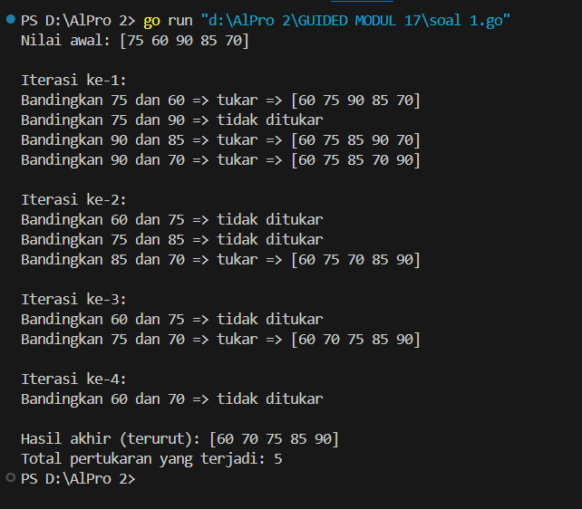
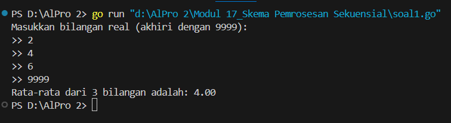
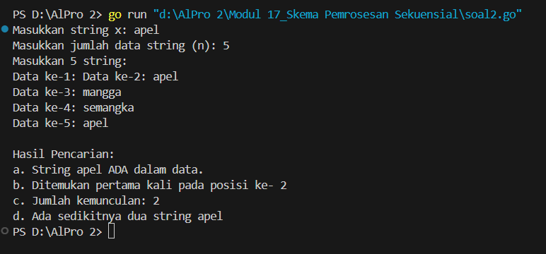
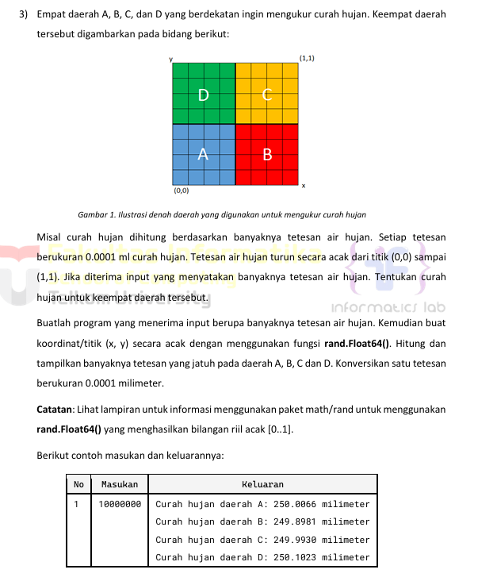
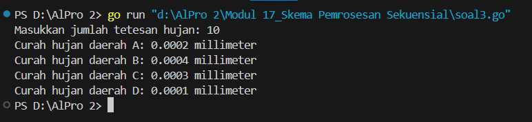
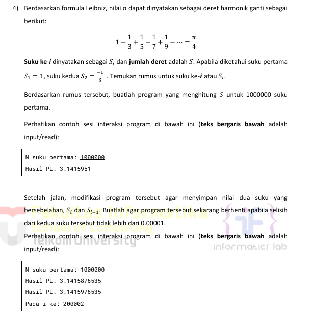
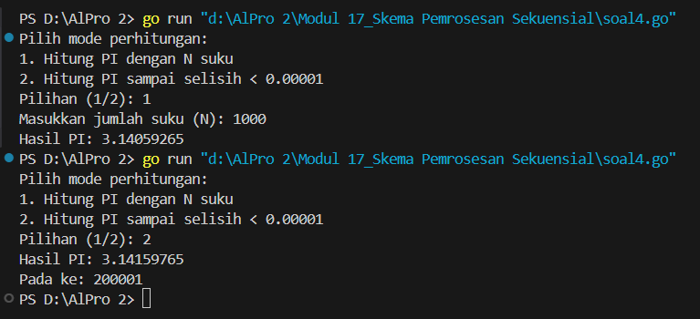
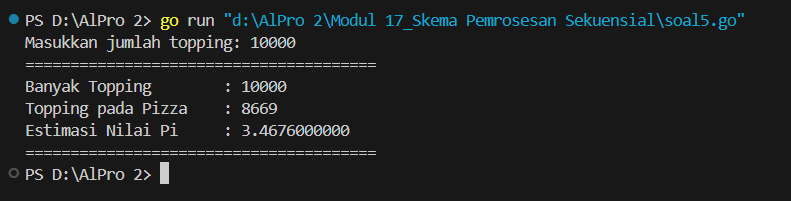

<h1 align="center">Laporan Praktikum Modul 17 <br>Skema Pemrosesan Sekuensial</h1>
<p align="center">NAFILA SETYANI - 103112430019</p>

## Dasar Teori
**Skema pemrosesan sekuensial** adalah metode eksekusi program di mana **instruksi dijalankan satu per satu secara berurutan**, dimulai dari baris paling atas hingga baris paling bawah, **tanpa melibatkan proses paralel atau pemrosesan bersamaan (concurrent)**. Dalam skema ini, program akan mengeksekusi setiap perintah sesuai urutan penulisannya di dalam kode, sehingga alur logika mudah diikuti dan diprediksi.

Dalam bahasa pemrograman Go, hal ini berarti program berjalan **secara linear**, dimulai dari **baris pertama** dan berlanjut terus hingga akhir file, **kecuali terdapat struktur kendali alur** seperti pernyataan `if`, perulangan `for`, atau pemanggilan fungsi. Struktur-struktur ini memungkinkan perubahan arah eksekusi, namun tetap berada dalam konteks sekuensial selama tidak melibatkan fitur konkuren seperti goroutine atau channel.

## Guided
#### Soal 
Aldi memiliki daftar nilai ulangan matematika temannya: 75, 60, 90, 85, dan 70. Ia ingin mengurutkan nilai tersebut dari yang terkecil ke yang terbesar menggunakan **metode Bubble Sort**.
**Pertanyaan:**
1. Tunjukkan proses pengurutan nilai menggunakan Bubble Sort **hingga semua nilai terurut.**
2. Berapa kali pertukaran (swap) terjadi dalam proses ini?

```go
package main

  

import (
    "fmt"
)
func main() {
    nilai := []int{75, 60, 90, 85, 70}
    n := len(nilai)
    swapCount := 0
    fmt.Println("Nilai awal:", nilai)
    // Proses Bubble Sort
    for i := 0; i < n-1; i++ {
        fmt.Printf("\nIterasi ke-%d:\n", i+1)
        for j := 0; j < n-i-1; j++ {
            fmt.Printf("Bandingkan %d dan %d", nilai[j], nilai[j+1])
            if nilai[j] > nilai[j+1] {
                // Tukar nilai
                nilai[j], nilai[j+1] = nilai[j+1], nilai[j]
                swapCount++
                fmt.Printf(" => tukar => %v\n", nilai)
            } else {
                fmt.Println(" => tidak ditukar")
            }
        }
    }
    fmt.Println("\nHasil akhir (terurut):", nilai)
    fmt.Println("Total pertukaran yang terjadi:", swapCount)
}
```

Program ini berfungsi untuk **mengurutkan data nilai** dari yang terkecil ke yang terbesar menggunakan **algoritma Bubble Sort**, serta menghitung **jumlah pertukaran (swap)** yang terjadi selama proses pengurutan.

## Unguided

### Soal Latihan Modul 17

#### Soal 1
>Diberikan sejumlah bilangan real yang diakhiri dengan marker 9999, cari rerata dari bilanganbilangan tersebut.
```go
package main
import "fmt"
func main() {
    fmt.Println("Masukkan bilangan real (akhiri dengan 9999):")
    count, sum := ambilInput()
    if count == 0 {
        fmt.Println("Tidak ada data yang dihitung.")
        return
    }
    fmt.Printf("Rata-rata dari %d bilangan adalah: %.2f\n", count, sum/float64(count))
}
func ambilInput() (int, float64) {
    var nilai float64
    var total float64
    var banyak int
    for {
        fmt.Print(">> ")
        fmt.Scan(&nilai)
        if nilai == 9999 {
            break
        }
        total += nilai
        banyak++
    }
    return banyak, total
}
```


Program Go di atas berfungsi untuk menghitung rata-rata dari sejumlah bilangan real yang dimasukkan oleh pengguna hingga pengguna memasukkan angka 9999 sebagai penanda akhir input. Program dimulai dengan menampilkan pesan permintaan input, lalu memanggil fungsi `ambilInput()` untuk membaca bilangan satu per satu. Setiap bilangan ditambahkan ke total dan jumlah data (`banyak`) bertambah. Jika pengguna memasukkan 9999, pengulangan berhenti dan fungsi mengembalikan total dan jumlah bilangan yang telah dimasukkan. Di fungsi `main`, jika tidak ada data yang dihitung (jumlah data nol), maka ditampilkan pesan bahwa tidak ada data. Jika ada, program menghitung dan mencetak rata-rata dari bilangan tersebut dengan format dua angka di belakang koma.

#### Soal 2
Diberikan string x dan n buah string. x adalah data pertama yang dibaca, n adalah data bilangan yang dibaca kedua, dan n data berikutnya adalah data string. Buat algoritma untuk menjawab pertanyaan berikut: 
a. Apakah string x ada dalam kumpulan n data string tersebut? 
b. Pada posisi ke berapa string x tersebut ditemukan?
c. Ada berapakah string x dalam kumpulan n data string tersebut?
d. Adakah sedikitnya dua string x dalam n data string tersebut?
```go
package main
import (
    "bufio"
    "fmt"
    "os"
    "strings"
)
func main() {
    var x string
    var n int
    reader := bufio.NewReader(os.Stdin)
    fmt.Print("Masukkan string x: ")
    x, _ = reader.ReadString('\n')
    x = strings.TrimSpace(x)
    fmt.Print("Masukkan jumlah data string (n): ")
    fmt.Scan(&n)
    data := []string{}
    fmt.Println("Masukkan", n, "string:")
    for i := 1; i <= n; i++ {
        fmt.Printf("Data ke-%d: ", i)
        input, _ := reader.ReadString('\n')
        data = append(data, strings.TrimSpace(input))
    }
    jumlah := 0
    posisiPertama := -1
    for idx, val := range data {
        if val == x {
            jumlah++
            if posisiPertama == -1 {
                posisiPertama = idx + 1
            }
        }
    }
  
    fmt.Println("\nHasil Pencarian:")
    if jumlah > 0 {
        fmt.Println("a. String", x, "ADA dalam data.")
        fmt.Println("b. Ditemukan pertama kali pada posisi ke-", posisiPertama)
    } else {
        fmt.Println("a. String", x, "TIDAK ADA dalam data.")
        fmt.Println("b. Tidak ditemukan, jadi tidak ada posisi.")
    }
    fmt.Println("c. Jumlah kemunculan:", jumlah)
    if jumlah >= 2 {
        fmt.Println("d. Ada sedikitnya dua string", x)
    } else {
        fmt.Println("d. TIDAK ada sedikitnya dua string", x)
    }
}
```


Program Go di atas bertujuan untuk mencari sebuah string tertentu dalam sekumpulan data string yang dimasukkan oleh pengguna. Program dimulai dengan meminta input string yang ingin dicari (`x`) dan jumlah data yang akan dimasukkan (`n`). Menggunakan `bufio.NewReader`, program membaca data satu per satu dan menyimpannya dalam slice `data`. Setelah semua data dimasukkan, program melakukan pencarian menggunakan perulangan `range` untuk menghitung jumlah kemunculan string `x` serta mencatat posisi pertama saat string tersebut ditemukan. Terakhir, program mencetak hasil pencarian berupa informasi apakah string ditemukan, posisi pertama kemunculan, total kemunculan, dan apakah string tersebut muncul sedikitnya dua kali. Program ini menggunakan pendekatan yang efisien dalam membaca input string termasuk yang mengandung spasi.
#### Soal 3

```go
package main

import (
	"fmt"
	"math/rand"
	"time"
)

func main() {
	var tetesan int
	fmt.Print("Masukkan jumlah tetesan hujan: ")
	fmt.Scan(&tetesan)

	rand.Seed(time.Now().UnixNano())
	count := [4]int{} // Indeks 0 = A, 1 = B, 2 = C, 3 = D

	for i := 0; i < tetesan; i++ {
		x, y := rand.Float64(), rand.Float64()
		if x < 0.5 && y < 0.5 {
			count[0]++
		} else if x >= 0.5 && y < 0.5 {
			count[1]++
		} else if x < 0.5 && y >= 0.5 {
			count[2]++
		} else {
			count[3]++
		}
	}

	label := []string{"A", "B", "C", "D"}
	for i := 0; i < 4; i++ {
		fmt.Printf("Curah hujan daerah %s: %.4f millimeter\n", label[i], float64(count[i])*0.0001)
	}
}

```


Program ini mensimulasikan tetesan hujan acak yang jatuh di empat daerah berbeda berdasarkan koordinat `x` dan `y` yang dihasilkan secara acak antara 0 dan 1. Berdasarkan nilai `x` dan `y`, setiap tetesan akan dikategorikan ke salah satu dari empat wilayah (A, B, C, atau D) dengan kondisi: A untuk kuadran kiri bawah, B untuk kanan bawah, C untuk kiri atas, dan D untuk kanan atas. Jumlah tetesan di setiap daerah dihitung dan dikalikan dengan 0.0001 untuk mendapatkan total curah hujan dalam satuan milimeter. Versi ini menggunakan array dan perulangan untuk mengurangi pengulangan kode dan meningkatkan keterbacaan.
#### Soal 4

```go
package main

import (
	"fmt"
	"math"
)

func hitungPiDenganLoop(n int) float64 {
	pi := 0.0
	sign := 1.0
	for i := 0; i < n; i++ {
		pi += sign / float64(2*i+1)
		sign *= -1
	}
	return pi * 4
}

func hitungPiDenganPresisi(target float64) (float64, int) {
	pi, sign := 0.0, 1.0
	prev := 0.0
	i := 0

	for {
		pi += sign / float64(2*i+1)
		current := pi * 4
		if math.Abs(current-prev) < target {
			return current, i + 1
		}
		prev = current
		sign *= -1
		i++
	}
}

func main() {
	var mode int
	fmt.Println("Pilih mode perhitungan:")
	fmt.Println("1. Hitung PI dengan N suku")
	fmt.Println("2. Hitung PI sampai selisih < 0.00001")
	fmt.Print("Pilihan (1/2): ")
	fmt.Scan(&mode)

	switch mode {
	case 1:
		var n int
		fmt.Print("Masukkan jumlah suku (N): ")
		fmt.Scan(&n)
		pi := hitungPiDenganLoop(n)
		fmt.Printf("Hasil PI: %.8f\n", pi)
	case 2:
		const epsilon = 0.00001
		pi, iterasi := hitungPiDenganPresisi(epsilon)
		fmt.Printf("Hasil PI: %.8f\n", pi)
		fmt.Printf("Pada ke: %d\n", iterasi)
	default:
		fmt.Println("Pilihan tidak valid.")
	}
}

```


Program ini menghitung nilai π (pi) menggunakan deret Leibniz, dengan dua pilihan metode. Pengguna dapat memilih menghitung pi berdasarkan jumlah suku tertentu (mode 1) atau hingga hasil mendekati nilai stabil dengan selisih antar iterasi kurang dari `0.00001` (mode 2). Perhitungan dilakukan dengan menjumlahkan atau mengurangkan suku-suku dari deret secara bergantian, yaitu `1 - 1/3 + 1/5 - 1/7 + ...` yang kemudian dikalikan 4 untuk mendapatkan nilai pi. Versi program ini menggunakan pendekatan `sign` untuk menentukan tanda (+ atau -) dari setiap suku dan tetap memberikan hasil akhir yang sama dengan versi aslinya. Program ini juga mencetak nilai π yang dihasilkan dan (untuk mode 2) jumlah iterasi yang dibutuhkan.
#### Soal 5
Monti bekerja pada sebuah kedai pizza, saking ramainya kedai tersebut membuat Monti tidak ada waktu untuk bersantai. Suatu ketika saat sedang menaburkan topping pada pizza yang diletakkan pada wadah berbentuk persegi, terpikirkan oleh Monti cara menghitung berapa banyak topping yang dia butuhkan, dan cara menghitung nilai 𝝅. Ilustrasi seperti gambar yang diberikan di bawah, topping adalah lingkaran-lingkaran kecil. Ada yang tepat berada di atas pizza, dan ada yang jatuh di dalam kotak tetapi berada di luar pizza.
Apabila luas pizza yang memiliki radius r adalah 𝐿𝑢𝑎𝑠𝑃𝑖𝑧𝑧𝑎 = 𝜋𝑟 2 dan luas wadah pizza yang memiliki panjang sisi 𝑑 = 2𝑟 adalah 𝐿𝑢𝑎𝑠𝑊𝑎𝑑𝑎ℎ = 𝑑 2 = 4𝑟 2 , maka diperoleh perbandingan luas kedua bidang tersebut 𝐿𝑢𝑎𝑠𝑃𝑖𝑧𝑧𝑎 𝐿𝑢𝑎𝑠𝑊𝑎𝑑𝑎ℎ = 𝜋𝑟 2 4𝑟 2 = 𝜋 4 Persamaan lingkaran adalah (𝑥 − 𝑥𝑐) 2 + (𝑦 − 𝑦𝑐) 2 = 𝑟 2 dengan titik pusat lingkaran adalah (𝑥𝑐 , 𝑦𝑐). Suatu titik sembarang (𝑥, 𝑦) dikatakan berada di dalam lingkaran apabila memenuhi ketidaksamaan: (𝑥 − 𝑥𝑐) 2 + (𝑦 − 𝑦𝑐) 2 ≤ 𝑟 2 Pada ilustrasi topping berbentuk bulat kecil merah dan biru pada gambar adalah titik-titik (𝑥, 𝑦) acak pada sebuah wadah yang berisi pizza. Dengan jumlah yang sangat banyak dan ditaburkan merata (secara acak), maka kita bisa mengetahui berapa banyak titik/topping yang berada tepat di dalam pizza menggunakan ketidaksamaan di atas.
Buatlah program yang menerima input berupa banyaknya topping yang akan ditaburkan, kemudian buat titik acak (𝑥, 𝑦) dari bilangan acak riil pada kisaran nilai 0 hingga 1 sebanyak topping yang diberikan. Hitung dan tampilkan berapa banyak topping yang jatuh tepat di atas pizza. Titik pusat pizza adalah (0.5, 0.5) dan jari-jari pizza adalah 0.5 satuan wadah.
```go
package main

import (
	"fmt"
	"math"
	"math/rand"
	"time"
)

func main() {
	var jumlahTopping int
	fmt.Print("Masukkan jumlah topping: ")
	fmt.Scan(&jumlahTopping)

	estimasiPi, dalamLingkaran := monteCarloPi(jumlahTopping)

	fmt.Println("=======================================")
	fmt.Printf("Banyak Topping        : %d\n", jumlahTopping)
	fmt.Printf("Topping pada Pizza    : %d\n", dalamLingkaran)
	fmt.Printf("Estimasi Nilai Pi     : %.10f\n", estimasiPi)
	fmt.Println("=======================================")
}

func monteCarloPi(n int) (float64, int) {
	rand.Seed(time.Now().UnixNano())

	hit := 0
	for i := 0; i < n; i++ {
		x, y := rand.NormFloat64()/2, rand.NormFloat64()/2
		if math.Hypot(x, y) <= 1.0 {
			hit++
		}
	}
	return 4 * float64(hit) / float64(n), hit
}

```


Program ini menggunakan metode Monte Carlo untuk memperkirakan nilai π (pi) dengan mensimulasikan “topping” yang dijatuhkan secara acak ke dalam bidang persegi 2x2. Topping dianggap “jatuh di atas pizza” jika posisinya berada di dalam lingkaran dengan jari-jari 1.0 yang terpusat di titik (0,0). Dalam versi alternatif ini, digunakan fungsi `math.Hypot(x, y)` untuk menghitung jarak titik `(x, y)` ke pusat, dan nilai `x` dan `y` disimulasikan dengan distribusi normal menggunakan `rand.NormFloat64()` agar berbeda dari `rand.Float64()` pada versi asli. Hasil perhitungan pi tetap didapatkan dari rasio jumlah titik di dalam lingkaran terhadap total titik, dikalikan 4. Output tetap menampilkan jumlah topping, jumlah topping yang masuk lingkaran (pizza), dan estimasi nilai pi.


