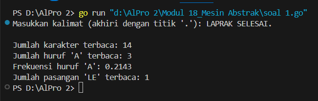

<h1 align="center">Laporan Praktikum Modul 18 <br>Mesin Abstrak</h1>
<p align="center">NAFILA SETYANI - 103112430019</p>

## Dasar Teori
Mesin abstrak merupakan suatu pendekatan dalam model komputasi yang dibangun berdasarkan model mesin komputasi yang telah ada sebelumnya. Dalam proses perancangannya, tipe data dan operasi-operasi dasar pada mesin abstrak dikembangkan dengan memanfaatkan tipe data serta operasi yang telah tersedia pada mesin di tingkat bawah. Pendekatan ini menjadi salah satu teknik penting dalam pengembangan perangkat lunak, karena memungkinkan pengembang untuk membuat sistem yang lebih kompleks dengan bertumpu pada struktur dan kemampuan mesin yang sudah ada, sehingga mempermudah dalam pengelolaan kompleksitas dan meningkatkan efisiensi dalam proses rekayasa perangkat lunak.
### Soal Latihan Modul 18 Mesin Abstrak

#### Soal 1

>Implementasi mesin abstrak karakter yang bekerja terhadap untaian karakter (yang diakhiri dengan penanda titik (".") dan mempunyai sejumlah operasi dasar. 
>a) Operasi dasar mesin karakter: 
>- Prosedur start(); yang menyiapkan mesin karakter di awal rangkaian karakter. 
>- Prosedur maju(); yang memajukan pembaca ke posisi karakter berikutnya. 
>- Fungsi eop(); yang mengembalikan nilai true apabila sudah mencapai akhir rangkaian, sampai ke penanda titik ("."). 
>- Fungsi cc(); yang mengembalikan karakter yang sedang terbaca, atau berada pada posisi pembacaan mesin. 
>b) Dengan operasi dasar di atas buat algoritma untuk: 
>- Membaca seluruh karakter yang diberikan ke mesin karakter tersebut. 
>- Menghitung berapa banyak karakter yang terbaca. 
>- Menghitung ada berapa huruf "A" yang terbaca. 
>- Menghitung frekuensi kemunculan huruf "A" terhadap seluruh karakter terbaca. 
>- Menghitung ada berapa kata "LE" (pasangan berturutan huruf "L" dan "E") yang terbaca.

```go
package main
import (
    "bufio"
    "fmt"
    "os"
    "strings"
)
type KarakterScanner struct {
    teks    string
    indeks  int
    panjang int
}
func (ks *KarakterScanner) Mulai() {
    ks.indeks = 0
}
func (ks *KarakterScanner) Lanjut() {
    if ks.indeks < ks.panjang {
        ks.indeks++
    }
}
func (ks *KarakterScanner) Akhir() bool {
    return ks.indeks >= ks.panjang || ks.teks[ks.indeks] == '.'
}
func (ks *KarakterScanner) KarakterSekarang() byte {
    if ks.indeks < ks.panjang {
        return ks.teks[ks.indeks]
    }
    return 0
}
func main() {
    pembaca := bufio.NewReader(os.Stdin)
    fmt.Print("Masukkan kalimat (akhiri dengan titik '.'): ")
    input, _ := pembaca.ReadString('\n')
    input = strings.TrimSpace(input)
    input = strings.ToUpper(input)
    pemindai := KarakterScanner{
        teks:    input,
        panjang: len(input),
    }
    pemindai.Mulai()
    var totalKarakter, jumlahA, jumlahLE int
    var sebelumnya byte
    for !pemindai.Akhir() {
        karakter := pemindai.KarakterSekarang()
        totalKarakter++
        if karakter == 'A' {
            jumlahA++
        }
        if sebelumnya == 'L' && karakter == 'E' {
            jumlahLE++
        }
        sebelumnya = karakter
        pemindai.Lanjut()
    }
    var frekuensiA float64
    if totalKarakter > 0 {
        frekuensiA = float64(jumlahA) / float64(totalKarakter)
    }
    fmt.Printf("\nJumlah karakter terbaca: %d\n", totalKarakter)
    fmt.Printf("Jumlah huruf 'A' terbaca: %d\n", jumlahA)
    fmt.Printf("Frekuensi huruf 'A': %.4f\n", frekuensiA)
    fmt.Printf("Jumlah pasangan 'LE' terbaca: %d\n", jumlahLE)
}

```



Program di atas berfungsi untuk membaca sebuah kalimat dari pengguna, lalu menghitung jumlah total karakter (hingga sebelum tanda titik), jumlah huruf 'A', frekuensi kemunculan huruf 'A', serta jumlah pasangan huruf 'LE'. Program menggunakan struct bernama `KarakterScanner` untuk menavigasi teks karakter per karakter. Metode-metode seperti `Mulai`, `Lanjut`, `Akhir`, dan `KarakterSekarang` membantu dalam membaca setiap karakter secara berurutan. Setelah proses pembacaan, program menampilkan hasil perhitungan tersebut ke layar. Pendekatan ini meniru cara kerja mesin karakter dalam teori automata, dan cocok untuk pembelajaran pemrosesan teks sederhana di tingkat karakter.