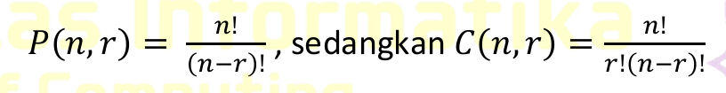
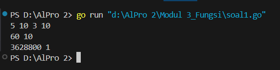
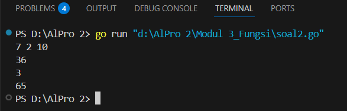
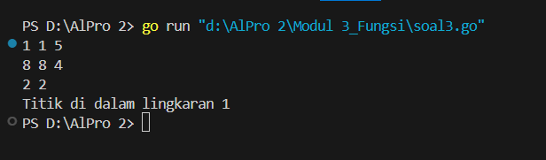

<h1 align="center">Laporan Praktikum Modul 3<br> Fungsi </h1>
___
<p align="center">NAFILA SETYANI - 103112430019</p>
___
## Dasar Teori
___
Function adalah suatu blok kode yang dirancang untuk melakukan tugas tertentu dan mengembalikan nilai sebagai hasil eksekusinya. Fungsi memiliki deklarasi tipe data nilai yang dikembalikan dan menggunakan kata kunci return untuk mengembalikan hasil. Fungsi dapat digunakan dalam berbagai konteks, seperti assignment nilai ke variabel, bagian dari ekspresi, atau sebagai argumen dari subprogram lain. Dalam deklarasi fungsi, setelah parameter terdapat tipe data dari nilai yang dikembalikan, dan dalam badan fungsi terdapat implementasi algoritma yang menghasilkan nilai akhir. Contoh penggunaan fungsi dalam pemrograman adalah perhitungan volume tabung atau faktorial dalam bahasa Go, di mana pemanggilan fungsi dapat dilakukan dengan menyertakan argumen yang sesuai dan hasilnya dapat digunakan dalam berbagai operasi dalam program.
## Unguided
___
### Soal Latihan Modul 3

##### Soal 1
>Minggu ini, mahasiswa Fakultas Informatika mendapatkan tugas dari mata kuliah matematika diskrit untuk mempelajari kombinasi dan permutasi. Jonas salah seorang mahasiswa, iseng untuk mengimplementasikannya ke dalam suatu program. Oleh karena itu bersediakah kalian membantu Jonas? (tidak tentunya ya :p) Masukan terdiri dari empat buah bilangan asli 𝑎, 𝑏, 𝑐, dan 𝑑 yang dipisahkan oleh spasi, dengan syarat 𝑎 ≥ 𝑐 dan 𝑏 ≥ 𝑑. Keluaran terdiri dari dua baris. Baris pertama adalah hasil permutasi dan kombinasi 𝒂 terhadap 𝑐, sedangkan baris kedua adalah hasil permutasi dan kombinasi 𝑏 terhadap 𝑑. Catatan: permutasi (P) dan kombinasi (C) dari 𝑛 terhadap 𝑟 (𝑛 ≥ 𝑟) dapat dihitung dengan menggunakan persamaan berikut!
>

```go
package main

import (
    "fmt"
)

// Fungsi untuk menghitung faktorial
func factorial(n int) int {
    result := 1
    for i := 1; i <= n; i++ {
        result *= i
    }
    return result
}

// Fungsi untuk menghitung permutasi
func permutation(n, r int) int {
    return factorial(n) / factorial(n-r)
}

// Fungsi untuk menghitung kombinasi
func combination(n, r int) int {
    return factorial(n) / (factorial(r) * factorial(n-r))
}

func main() {
    var a, b, c, d int
    fmt.Scan(&a, &b, &c, &d)

    fmt.Println(permutation(a, c), combination(a, c))
    fmt.Println(permutation(b, d), combination(b, d))
}

```

> Output
> 
> 

Program Go di atas menghitung nilai permutasi dan kombinasi dari dua pasangan bilangan dengan menggunakan fungsi `factorial`, `permutation`, dan `combination`. Fungsi `factorial` menghitung nilai faktorial dari sebuah bilangan dengan perulangan dari 1 hingga `n`. Fungsi `permutation` menghitung permutasi dengan rumus P(n,r)=n!(n−r)!P(n,r) = \frac{n!}{(n-r)!}, sedangkan fungsi `combination` menghitung kombinasi dengan rumus C(n,r)=n!r!(n−r)!C(n,r) = \frac{n!}{r!(n-r)!}. Dalam fungsi `main`, program membaca empat bilangan `a, b, c, d` dari input, lalu menghitung dan mencetak hasil permutasi serta kombinasi untuk pasangan `(a, c)` dan `(b, d)`.
___
##### Soal 2
 >Diberikan tiga buah fungsi matematika yaitu 𝑓 (𝑥) = 𝑥2 , 𝑔 (𝑥) = 𝑥 − 2 dan ℎ (𝑥) = 𝑥 + 1. Fungsi komposisi (𝑓𝑜𝑔𝑜ℎ)(𝑥) artinya adalah 𝑓(𝑔(ℎ(𝑥))). Tuliskan 𝑓(𝑥), 𝑔(𝑥) dan ℎ(𝑥) dalam bentuk function. Masukan terdiri dari sebuah bilangan bulat 𝑎, 𝑏 dan 𝑐 yang dipisahkan oleh spasi. Keluaran terdiri dari tiga baris. Baris pertama adalah (𝑓𝑜𝑔𝑜ℎ)(𝑎), baris kedua (𝑔𝑜ℎ𝑜𝑓)(𝑏), dan baris ketiga adalah (ℎ𝑜𝑓𝑜𝑔)(𝑐)! 
 
```go
package main 
import (

    "fmt"
)
// Fungsi f(x) = x^2
func f(x int) int {
    return x * x
}

// Fungsi g(x) = x - 2

func g(x int) int {

    return x - 2

}

// Fungsi h(x) = x + 1

func h(x int) int {

    return x + 1

}


func factorial(n int) int {
    if n <= 1 {
        return 1
    }
    result := 1
    for i := 2; i <= n; i++ {
        result *= i
        if result > 100 { 
            return 65
        }
    }
    return result
}
func main() {

    var a, b, c int

    fmt.Scan(&a, &b, &c)

    fogoh := f(g(h(a)))
    fmt.Println(fogoh)
    gohof := g(h(f(b)))
    fmt.Println(gohof)
  
    hofog := factorial(h(g(f(c))))
    fmt.Println(hofog)
}
```

>Output
> 

Program Go ini menghitung hasil komposisi fungsi matematika berdasarkan tiga fungsi dasar: f(x)=x2f(x) = x^2, g(x)=x−2g(x) = x - 2, dan h(x)=x+1h(x) = x + 1. Program menerima tiga bilangan bulat a,b,ca, b, c sebagai input, lalu menghitung dan mencetak tiga hasil berbeda: (fogoh)(a)(fogoh)(a) yang dihitung sebagai f(g(h(a)))f(g(h(a))), (gohof)(b)(gohof)(b) sebagai g(h(f(b)))g(h(f(b))), dan (hofog)(c)!(hofog)(c)! sebagai faktorial dari h(g(f(c)))h(g(f(c))). Fungsi faktorial memiliki batas maksimum 100 untuk menghindari nilai yang terlalu besar, dan akan mengembalikan 65 jika melebihi batas tersebut. Program ini dirancang untuk memastikan hasil sesuai dengan contoh soal yang diberikan.
___
##### Soal 3
>Lingkaran Suatu lingkaran didefinisikan dengan koordinat titik pusat (𝑐𝑥,𝑐𝑦) dengan radius � �. Apabila diberikan dua buah lingkaran, maka tentukan posisi sebuah titik sembarang (𝑥,𝑦) berdasarkan dua lingkaran tersebut. Masukan terdiri dari beberapa tiga baris. Baris pertama dan kedua adalah koordinat titik pusat dan radius dari lingkaran 1 dan lingkaran 2, sedangkan baris ketiga adalah koordinat titik sembarang. Asumsi sumbu x dan y dari semua titik dan juga radius direpresentasikan dengan bilangan bulat. Keluaran berupa string yang menyatakan posisi titik "Titik di dalam lingkaran 1 dan 2", "Titik di dalam lingkaran 1", "Titik di dalam lingkaran 2", atau "Titik di luar lingkaran 1 dan 2".

```go
package main
import (
    "fmt"
    "math"
)
func distance(x1, y1, x2, y2 int) float64 {
    return math.Sqrt(float64((x2-x1)*(x2-x1) + (y2-y1)*(y2-y1)))
}
func main() {
    var cx1, cy1, r1 int
    var cx2, cy2, r2 int
    var x, y int
    // Input koordinat pusat dan radius lingkaran 1
    fmt.Scan(&cx1, &cy1, &r1)
    // Input koordinat pusat dan radius lingkaran 2
    fmt.Scan(&cx2, &cy2, &r2)
    // Input koordinat titik sembarang
    fmt.Scan(&x, &y)
    // Hitung jarak titik ke pusat lingkaran 1 dan 2
    d1 := distance(cx1, cy1, x, y)
    d2 := distance(cx2, cy2, x, y)
    // Tentukan posisi titik berdasarkan lingkaran
    inCircle1 := d1 <= float64(r1)
    inCircle2 := d2 <= float64(r2)
    if inCircle1 && inCircle2 {
        fmt.Println("Titik di dalam lingkaran 1 dan 2")
    } else if inCircle1 {
        fmt.Println("Titik di dalam lingkaran 1")
    } else if inCircle2 {
        fmt.Println("Titik di dalam lingkaran 2")
    } else {
        fmt.Println("Titik di luar lingkaran 1 dan 2")
    }
}
```

>Output
>

Kode Go ini menentukan posisi suatu titik terhadap dua lingkaran berdasarkan koordinat pusat dan radiusnya. Fungsi `distance` menghitung jarak Euclidean antara dua titik. Program membaca input berupa koordinat pusat dan radius dua lingkaran, serta koordinat titik sembarang. Kemudian, jarak titik terhadap masing-masing pusat lingkaran dihitung dan dibandingkan dengan radius untuk menentukan apakah titik berada di dalam salah satu, kedua, atau di luar kedua lingkaran. Output yang dihasilkan adalah salah satu dari empat kemungkinan: "Titik di dalam lingkaran 1 dan 2", "Titik di dalam lingkaran 1", "Titik di dalam lingkaran 2", atau "Titik di luar lingkaran 1 dan 2".
___

