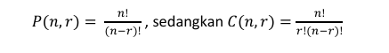
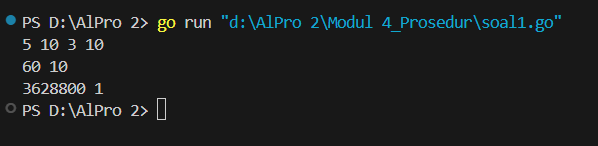
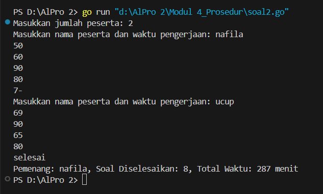
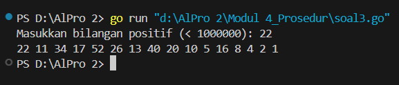

<h1 align="center">Laporan Praktikum Modul 4<br> Prosedur </h1>
___
<p align="center">NAFILA SETYANI - 103112430019</p>
___
## Dasar Teori
___
Prosedur dalam pemrograman merupakan subprogram yang berisi kumpulan instruksi yang dapat dipanggil untuk mengurangi kompleksitas kode dalam program yang lebih besar. Berbeda dengan fungsi, prosedur tidak mengembalikan nilai dan tidak menggunakan kata kunci `return`. Dalam bahasa Go, prosedur dituliskan menggunakan `func` tanpa tipe pengembalian. Prosedur dapat dideklarasikan di luar fungsi utama dan dipanggil dengan menyebutkan namanya serta memberikan argumen yang sesuai. Parameter dalam prosedur terbagi menjadi parameter formal dan aktual, serta dapat menggunakan mekanisme `pass by value` atau `pass by reference`. `Pass by value` menyalin nilai ke parameter formal tanpa mengubah variabel asli, sementara `pass by reference` menggunakan pointer agar perubahan dalam prosedur berdampak pada variabel pemanggil.
## Unguided
___
### Soal Latihan Modul 4

##### Soal 1
>Minggu ini, mahasiswa Fakultas Informatika mendapatkan tugas dari mata kuliah matematika diskrit untuk mempelajari kombinasi dan permutasi. Jonas salah seorang mahasiswa, iseng untuk mengimplementasikannya ke dalam suatu program. Oleh karena itu bersediakah kalian membantu Jonas? (tidak tentunya ya :p) 
>Masukan terdiri dari empat buah bilangan asli 𝑎, 𝑏, 𝑐, dan 𝑑 yang dipisahkan oleh spasi, dengan syarat 𝑎 ≥ 𝑐 dan 𝑏 ≥ 𝑑. 
>Keluaran terdiri dari dua baris. Baris pertama adalah hasil permutasi dan kombinasi 𝒂 terhadap 𝑐, sedangkan baris kedua adalah hasil permutasi dan kombinasi 𝑏 terhadap 𝑑. 
>Catatan: permutasi (P) dan kombinasi (C) dari 𝑛 terhadap 𝑟 (𝑛 ≥ 𝑟) dapat dihitung dengan menggunakan persamaan berikut!
>

```go
package main
import (
    "fmt"
)

// Fungsi untuk menghitung faktorial

func factorial(n int) int {
    result := 1
    for i := 2; i <= n; i++ {
        result *= i
    }
    return result
}
// Fungsi untuk menghitung permutasi

func permutation(n, r int) int {
    return factorial(n) / factorial(n-r)
}
// Fungsi untuk menghitung kombinasi
func combination(n, r int) int {
    return factorial(n) / (factorial(r) * factorial(n-r))
}
func main() {
    var a, b, c, d int
    fmt.Scan(&a, &b, &c, &d)
    // Pastikan bahwa a >= c dan b >= d
    if a >= c && b >= d {
        perm_a_c := permutation(a, c)
        comb_a_c := combination(a, c)
        perm_b_d := permutation(b, d)
        comb_b_d := combination(b, d)
        fmt.Println(perm_a_c, comb_a_c)
        fmt.Println(perm_b_d, comb_b_d)
    } else {
        fmt.Println("Input tidak valid: pastikan a >= c dan b >= d")
    }
}

```

> Output
> 
> 

Kode di atas adalah program Go yang menghitung permutasi dan kombinasi berdasarkan input empat bilangan asli (a, b, c, d). Program dimulai dengan mendefinisikan fungsi `factorial(n int)`, yang menghitung faktorial dari suatu bilangan menggunakan perulangan. Selanjutnya, fungsi `permutation(n, r int)` menghitung nilai permutasi dengan membagi faktorial `n` dengan faktorial `(n - r)`, sementara fungsi `combination(n, r int)` menghitung kombinasi dengan membagi faktorial `n` dengan hasil kali faktorial `r` dan faktorial `(n - r)`. Dalam fungsi `main()`, program membaca empat bilangan dari input, lalu memeriksa apakah `a ≥ c` dan `b ≥ d`. Jika syarat tersebut terpenuhi, program menghitung dan mencetak hasil permutasi dan kombinasi untuk `(a, c)` dan `(b, d)`. Jika tidak, program akan menampilkan pesan kesalahan bahwa input tidak valid.
___
##### Soal 2
 >Kompetisi pemrograman tingkat nasional berlangsung ketat. Setiap peserta diberikan 8 soal yang harus dapat diselesaikan dalam waktu 5 jam saja. Peserta yang berhasil menyelesaikan soal paling banyak dalam waktu paling singkat adalah pemenangnya. 
 >Buat program gema yang mencari pemenang dari daftar peserta yang diberikan. Program harus dibuat modular, yaitu dengan membuat prosedur hitungSkor yang mengembalikan total soal dan total skor yang dikerjakan oleh seorang peserta, melalui parameter formal. Pembacaan nama peserta dilakukan di program utama, sedangkan waktu pengerjaan dibaca di dalam prosedur. 
 >prosedure hitungSkor(in/out soal, skor : integer) 
 >Setiap baris masukan dimulai dengan satu string nama peserta tersebut diikuti dengan adalah 8 integer yang menyatakan berapa lama (dalam menit) peserta tersebut menyelesaikan soal. Jika tidak berhasil atau tidak mengirimkan jawaban maka otomatis dianggap menyelesaikan dalam waktu 5 jam 1 menit (301 menit). 
 >Satu baris keluaran berisi nama pemenang, jumlah soal yang diselesaikan, dan nilai yang diperoleh. Nilai adalah total waktu yang dibutuhkan untuk menyelesaikan soal yang berhasil diselesaikan. 
 
```go
package main
import (
	"fmt"
	"math"
)
// hitungSkor menghitung jumlah soal yang diselesaikan dan total waktu pengerjaan
func hitungSkor(waktu [8]int) (int, int) {
	jumlahSoal := 0
	totalWaktu := 0
	for _, t := range waktu {
		if t <= 300 {
			jumlahSoal++
			totalWaktu += t
		}
	}
	return jumlahSoal, totalWaktu
}
func main() {
	var n int
	fmt.Print("Masukkan jumlah peserta: ")
	fmt.Scan(&n)
	var namaPemenang string
	maxSoal := -1
	minWaktu := math.MaxInt32
	for i := 0; i < n; i++ {
		var nama string
		var waktu [8]int
		fmt.Print("Masukkan nama peserta dan waktu pengerjaan: ")
		fmt.Scan(&nama, &waktu[0], &waktu[1], &waktu[2], &waktu[3], &waktu[4], &waktu[5], &waktu[6], &waktu[7])

		jumlahSoal, totalWaktu := hitungSkor(waktu)
		if jumlahSoal > maxSoal || (jumlahSoal == maxSoal && totalWaktu < minWaktu) {
			maxSoal = jumlahSoal
			minWaktu = totalWaktu
			namaPemenang = nama
		}
	}
	fmt.Printf("Pemenang: %s, Soal Diselesaikan: %d, Total Waktu: %d menit\n", namaPemenang, maxSoal, minWaktu)
}
```

>Output
>
> 

Program ini bertujuan untuk menentukan pemenang dalam kompetisi pemrograman berdasarkan jumlah soal yang berhasil diselesaikan dan total waktu pengerjaannya. Pertama, program meminta pengguna memasukkan jumlah peserta. Kemudian, untuk setiap peserta, program membaca nama dan waktu pengerjaan delapan soal. Setiap soal yang berhasil diselesaikan dalam waktu maksimal 300 menit dihitung sebagai soal yang valid, dan total waktu pengerjaan untuk soal-soal tersebut juga dijumlahkan. Proses ini dilakukan dalam fungsi `hitungSkor`, yang mengembalikan jumlah soal yang diselesaikan serta total waktu pengerjaannya. Di dalam fungsi `main`, program membandingkan setiap peserta berdasarkan jumlah soal yang berhasil diselesaikan, dengan peserta yang menyelesaikan soal terbanyak dianggap sebagai pemenang. Jika terdapat lebih dari satu peserta dengan jumlah soal yang sama, maka peserta dengan total waktu pengerjaan lebih sedikit yang akan dipilih sebagai pemenang. Akhirnya, program menampilkan nama pemenang beserta jumlah soal yang diselesaikan dan total waktu pengerjaan yang dibutuhkan.
___
##### Soal 3
>Skiena dan Revilla dalam Programming Challenges mendefinisikan sebuah deret bilangan. Deret dimulai dengan sebuah bilangan bulat n. Jika bilangan n saat itu genap, maka suku berikutnya adalah ½n, tetapi jika ganjil maka suku berikutnya bernilai 3n+1. Rumus yang sama digunakan terus menerus untuk mencari suku berikutnya. Deret berakhir ketika suku terakhir  bernilai 1. Sebagai contoh jika dimulai dengan n=22, maka deret bilangan yang diperoleh adalah: 
>22 11 34 17 52 26 13 40 20 10 5 16 8 4 2 1 
>Untuk suku awal sampai dengan 1000000, diketahui deret selalu mencapai suku dengan nilai 1. Buat program skiena yang akan mencetak setiap suku dari deret yang dijelaskan di atas untuk nilai suku awal yang diberikan. Pencetakan deret harus dibuat dalam prosedur cetakDeret yang mempunyai 1 parameter formal, yaitu nilai dari suku awal. 
>prosedure cetakDeret(in n : integer ) 
>Masukan berupa satu bilangan integer positif yang lebih kecil dari 1000000. 
>Keluaran terdiri dari satu baris saja. Setiap suku dari deret tersebut dicetak dalam baris yang dan dipisahkan oleh sebuah spasi.

```go
package main
import (
	"fmt"
)
// cetakDeret mencetak deret bilangan berdasarkan aturan Skiena dan Revilla
func cetakDeret(n int) {
	for n != 1 {
		fmt.Print(n, " ")
		if n%2 == 0 {
			n /= 2
		} else {
			n = 3*n + 1
		}
	}
	fmt.Println(1)
}
func main() {
	var n int
	fmt.Print("Masukkan bilangan positif (< 1000000): ")
	fmt.Scan(&n)

	if n > 0 && n < 1000000 {
		cetakDeret(n)
	} else {
		fmt.Println("Input tidak valid. Masukkan bilangan positif kurang dari 1000000.")
	}
}
```

>Output
>

Program di atas mengimplementasikan aturan Skiena dan Revilla untuk mencetak deret bilangan berdasarkan nilai awal yang diberikan oleh pengguna.

Pada fungsi cetakDeret, program mencetak setiap angka dalam deret hingga mencapai angka **1**. Jika angka saat ini **genap**, maka akan dibagi **2**, sedangkan jika **ganjil**, akan dikalikan **3** lalu ditambah **1**. Perulangan berlanjut hingga angka terakhir mencapai **1**, yang kemudian juga dicetak.

Dalam fungsi `main`, program meminta pengguna memasukkan **bilangan positif kurang dari 1.000.000**. Jika input valid, fungsi `cetakDeret` dipanggil untuk mencetak deret. Jika input tidak valid, program menampilkan pesan kesalahan.
___

