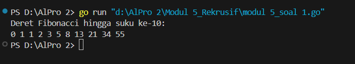
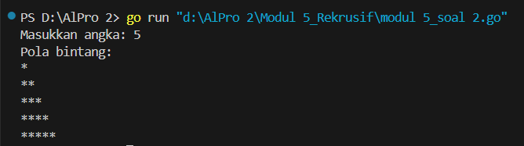
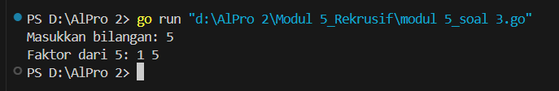
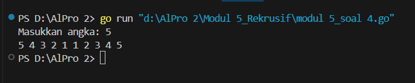
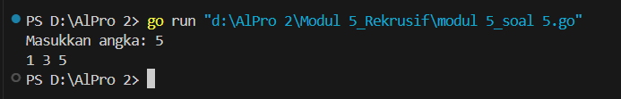
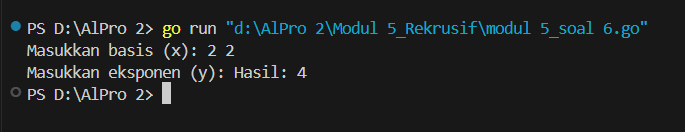

#<h1 align="center">Laporan Praktikum Modul 5 <br> Rekrusif </h1>
___
<p align="center">NAFILA SETYANI - 103112430019</p>
___
## Dasar Teori
___
Rekursif dalam bahasa Go adalah teknik pemrograman di mana suatu fungsi memanggil dirinya sendiri untuk menyelesaikan sub-masalah dari masalah utama. Teknik ini sering digunakan sebagai alternatif dari perulangan (loop) dalam menyelesaikan permasalahan yang bersifat berulang, seperti perhitungan faktorial, deret Fibonacci, atau pencarian pangkat bilangan. Rekursif terdiri dari dua komponen utama, yaitu **base-case** dan **recursive-case**. Base-case berfungsi sebagai kondisi penghentian rekursi agar tidak berjalan tanpa batas, sedangkan recursive-case adalah bagian di mana fungsi memanggil dirinya sendiri. Misalnya, dalam program cetak angka secara rekursif, tanpa base-case, program akan terus berjalan tanpa henti. Namun, jika diberikan base-case seperti `if x == 10`, maka pemanggilan rekursif akan berhenti saat x mencapai 10. Selain itu, dalam rekursi dikenal juga konsep **forward** (pemanggilan fungsi secara berulang hingga base-case terpenuhi) dan **backward** (kembali ke pemanggilan sebelumnya hingga selesai). Teknik rekursif dalam Go memungkinkan implementasi solusi yang lebih elegan dan sederhana untuk beberapa jenis masalah, meskipun dalam beberapa kasus, pendekatan iteratif bisa lebih efisien dalam penggunaan memori dan performa.
## Unguided
___
### Soal Latihan Modul 5

##### Soal 1
>Deret fibonacci adalah sebuah deret dengan nilai suku ke-0 dan ke-1 adalah 0 dan 1, dan nilai suku ke-n selanjutnya adalah hasil penjumlahan dua suku sebelumnya. Secara umum dapat diformulasikan 𝑆𝑛 = 𝑆𝑛−1 + 𝑆𝑛−2 . Berikut ini adalah contoh nilai deret fibonacci hingga suku ke-10. Buatlah program yang mengimplementasikan fungsi rekursif pada deret fibonacci tersebut.
><table>
    <tr>
        <th>n</th>
        <td>0</td>
        <td>1</td>
        <td>2</td>
        <td>3</td>
        <td>4</td>
        <td>5</td>
        <td>6</td>
        <td>7</td>
        <td>8</td>
        <td>9</td>
        <td>10</td>
    </tr>
    <tr>
        <th>S<sub>n</sub></th>
        <td>0</td>
        <td>1</td>
        <td>1</td>
        <td>2</td>
        <td>3</td>
        <td>5</td>
        <td>8</td>
        <td>13</td>
        <td>21</td>
        <td>34</td>
        <td>55</td>
    </tr>
</table>


```go
package main
import (
    "fmt"
)
// Fungsi rekursif untuk menghitung Fibonacci
func fibonacci(n int) int {
    if n == 0 {
        return 0
    } else if n == 1 {
        return 1
    }
    return fibonacci(n-1) + fibonacci(n-2)
    }

func main() {
    n := 10
    fmt.Println("Deret Fibonacci hingga suku ke-10:")
    for i := 0; i <= n; i++ {
        fmt.Print(fibonacci(i), " ")
    }
    fmt.Println()
}
```

> Output
> 
> 

Program ini ditulis dalam bahasa Go untuk menghitung dan menampilkan deret Fibonacci hingga suku ke-10 menggunakan pendekatan rekursif. Fungsi `fibonacci(n int) int` digunakan untuk menghitung bilangan Fibonacci secara rekursif, di mana nilai `0` dan `1` dikembalikan langsung untuk kasus dasar, sementara nilai lainnya dihitung dengan menjumlahkan hasil rekursi dari dua suku sebelumnya. Dalam fungsi `main()`, program menetapkan batas hingga suku ke-10 dan menggunakan perulangan `for` untuk mencetak setiap bilangan Fibonacci dari indeks `0` hingga `10`. Hasil akhirnya ditampilkan dalam bentuk deret angka yang dipisahkan oleh spasi.
___
##### Soal 2
 >Buatlah sebuah program yang digunakan untuk menampilkan pola bintang berikut ini dengan menggunakan fungsi rekursif. N adalah masukan dari user.
 
```go
package main
import (
    "fmt"
)
// Fungsi rekursif untuk mencetak bintang dalam satu baris
func printStars(n int) {
    if n == 0 {
        return
    }
    fmt.Print("*")
    printStars(n - 1)
}
// Fungsi rekursif untuk mencetak pola segitiga bintang
func printPattern(n, current int) {
    if current > n {
        return
    }
    printStars(current)
    fmt.Println()
    printPattern(n, current+1)
}
func main() {
    var n int
    fmt.Print("Masukkan angka: ")
    fmt.Scan(&n)
    fmt.Println("Pola bintang:")
    printPattern(n, 1)
}
```

>Output
> 

Program di atas menggunakan rekursi untuk mencetak pola segitiga bintang sesuai dengan input dari pengguna. Fungsi `printStars(n int)` bertugas mencetak `n` bintang dalam satu baris secara rekursif, dengan menghentikan eksekusi saat `n == 0`. Fungsi `printPattern(n, current int)` digunakan untuk mencetak segitiga bintang dengan menampilkan satu baris bintang sebanyak `current`, lalu memanggil dirinya sendiri dengan nilai `current+1` hingga mencapai `n`. Pada fungsi `main()`, pengguna diminta memasukkan angka `n`, lalu program memanggil `printPattern(n, 1)` untuk mencetak pola bintang dari satu hingga `n` baris.
___
##### Soal 3
>Buatlah program yang mengimplementasikan rekursif untuk menampilkan faktor bilangan dari suatu N, atau bilangan yang apa saja yang habis membagi N. Masukan terdiri dari sebuah bilangan bulat positif N. Keluaran terdiri dari barisan bilangan yang menjadi faktor dari N (terurut dari 1 hingga N ya).

```go
package main

import (
	"fmt"
)

// Fungsi rekursif untuk mencari dan mencetak faktor bilangan
func printFactors(n, i int) {
	if i > n {
		return
	}
	if n%i == 0 {
		fmt.Print(i, " ")
	}
	printFactors(n, i+1)
}

func main() {
	var n int
	fmt.Print("Masukkan bilangan: ")
	fmt.Scan(&n)

	fmt.Print("Faktor dari ", n, ": ")
	printFactors(n, 1)
	fmt.Println()
}
```

>Output
>

Fungsi `printFactors(n, i int)` digunakan untuk mencetak faktor-faktor dari NN secara rekursif. Jika ii habis membagi NN, maka ii akan dicetak. Fungsi ini terus dipanggil kembali dengan menaikkan nilai ii hingga mencapai NN. Sementara itu, fungsi `main()` meminta pengguna memasukkan bilangan NN dan kemudian memanggil `printFactors(n, 1)` untuk mencetak semua faktor NN dari 1 hingga NN.
___
##### Soal 4
>Buatlah program yang mengimplementasikan rekursif untuk menampilkan barisan bilangan tertentu. Masukan terdiri dari sebuah bilangan bulat positif N. Keluaran terdiri dari barisan bilangan dari N hingga 1 dan kembali ke N.

```go
package main
import (
    "fmt"
)
// Fungsi rekursif untuk menampilkan bilangan dari N ke 1
func printDescending(n int) {
    if n < 1 {
        return
    }
    fmt.Print(n, " ")
    printDescending(n - 1)
}
// Fungsi rekursif untuk menampilkan bilangan dari 1 ke N
func printAscending(n, current int) {
    if current > n {
        return
    }
    fmt.Print(current, " ")
    printAscending(n, current+1)
}
// Fungsi utama yang memanggil kedua fungsi rekursif
func printPattern(n int) {
    printDescending(n)
    printAscending(n, 1)
    fmt.Println()
}
func main() {
    var n int
    fmt.Print("Masukkan angka: ")
    fmt.Scan(&n)
    printPattern(n)
}
```

>Output
>

Program di atas menggunakan rekursi untuk mencetak pola angka sesuai dengan input yang diberikan. Fungsi `printDescending(n)` mencetak angka dari N hingga 1 secara rekursif, sedangkan `printAscending(n, current)` mencetak angka dari 1 hingga N. Fungsi `printPattern(n)` menggabungkan kedua fungsi tersebut untuk menghasilkan pola lengkap. Program ini membaca input angka dari pengguna dan menampilkan pola yang diinginkan.
___
##### Soal 5
>Buatlah program yang mengimplementasikan rekursif untuk menampilkan barisan bilangan ganjil. Masukan terdiri dari sebuah bilangan bulat positif N. Keluaran terdiri dari barisan bilangan ganjil dari 1 hingga N.

```go
package main
import (
    "fmt"
)
// Fungsi rekursif untuk mencetak bilangan ganjil dari 1 hingga N
func printOdd(n, current int) {
    if current > n {
        return
    }
    fmt.Print(current, " ")
    printOdd(n, current+2)
}
func main() {
    var n int
    fmt.Print("Masukkan angka: ")
    fmt.Scan(&n)
    printOdd(n, 1)
    fmt.Println()
}
```

>Output
>

Program di atas menggunakan rekursi untuk mencetak bilangan ganjil dari 1 hingga N. Fungsi `printOdd(n, current)` memulai dari angka 1 dan bertambah 2 setiap rekursi hingga mencapai atau melebihi N. Jika `current` lebih besar dari N, fungsi berhenti. Program ini membaca input angka dari pengguna dan mencetak bilangan ganjil dalam rentang tersebut secara rekursif.
___

##### Soal 6
>Buatlah program yang mengimplementasikan rekursif untuk mencari hasil pangkat dari dua buah bilangan. 
>Masukan terdiri dari bilangan bulat x dan y. 
>Keluaran terdiri dari hasil x dipangkatkan y. 
>Catatan: diperbolehkan menggunakan asterik "*", tapi dilarang menggunakan import "math".
>
```go
package main
import (
    "fmt"
)
// Fungsi rekursif untuk menghitung x pangkat y
func power(x, y int) int {
    if y == 0 {
        return 1
    }
    return x * power(x, y-1)
}
func main() {
    var x, y int
    fmt.Print("Masukkan basis (x): ")
    fmt.Scan(&x)
    fmt.Print("Masukkan eksponen (y): ")
    fmt.Scan(&y)
    fmt.Println("Hasil:", power(x, y))
}
```

>Output
>

Program di atas menggunakan rekursi untuk menghitung hasil perpangkatan xyx^yxy. Fungsi `power(x, y)` memeriksa apakah eksponen `y` sama dengan 0, yang merupakan kasus dasar dan mengembalikan 1. Jika tidak, fungsi mengalikan `x` dengan hasil rekursif dari `power(x, y-1)`. Program ini membaca input dua bilangan dari pengguna dan menampilkan hasil pangkatnya menggunakan rekursi.
___

