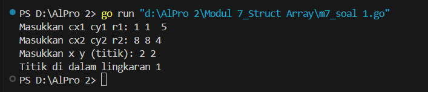
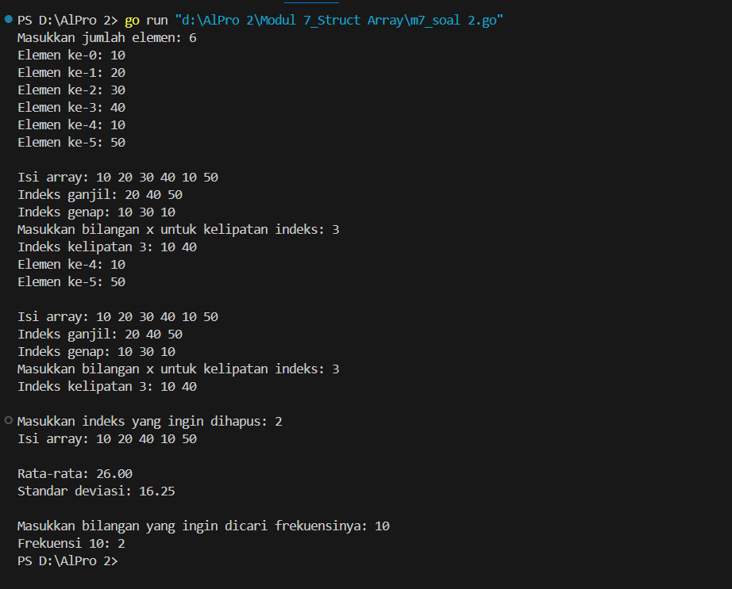
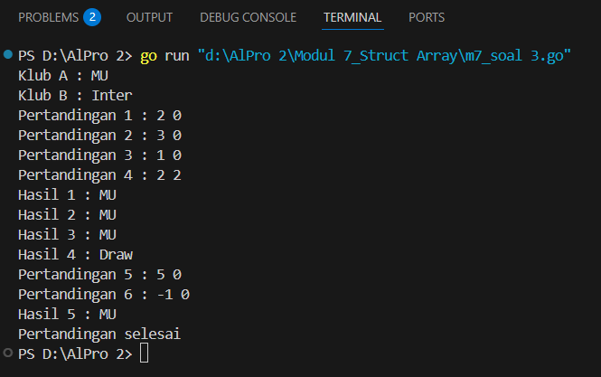
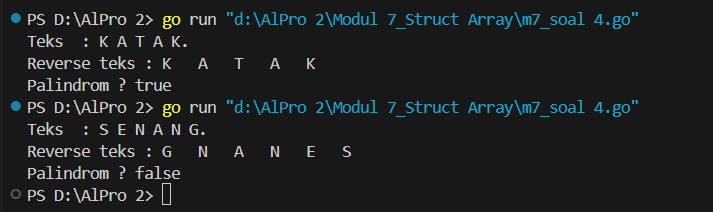

#<h1 align="center">Laporan Praktikum Modul 7 <br> Struct & Array</h1>
___
<p align="center">NAFILA SETYANI - 103112430019</p>
___
## Dasar Teori
___
Dalam pemrograman, _tipe bentukan_ memungkinkan kita membuat tipe data baru. Ada dua jenis: **alias** dan **struct**. Alias digunakan untuk memberikan nama baru pada tipe data yang sudah ada, agar lebih mudah dibaca dan digunakan. Contohnya, `type bilangan int` di Go menyederhanakan penggunaan tipe `int`.

Sementara itu, **struct** (atau record) digunakan untuk mengelompokkan beberapa nilai yang saling berkaitan dalam satu kesatuan. Masing-masing nilai disebut _field_. Struct berguna dalam menyimpan data kompleks seperti jam, menit, dan detik dalam satu variabel `waktu`.

**Array** adalah struktur data yang menyimpan sekumpulan elemen dengan tipe yang sama. Ukurannya tetap saat eksekusi program. Dalam Go, array dapat diakses lewat indeks dan dapat digabung dengan struct. Selain array tetap, Go juga menyediakan _slice_ (array dinamis) yang ukurannya bisa berubah, serta _map_, yaitu array asosiatif dengan kunci yang bisa bertipe non-integer.
## Unguided
___
### Soal Latihan Modul 7

##### Soal 1
>Suatu lingkaran didefinisikan dengan koordinat titik pusat (𝑐𝑥,𝑐𝑦) dengan radius 𝑟. Apabila diberikan dua buah lingkaran, maka tentukan posisi sebuah titik sembarang (𝑥,𝑦) berdasarkan dua lingkaran tersebut. Gunakan tipe bentukan titik untuk menyimpan koordinat, dan tipe bentukan lingkaran untuk menyimpan titik pusat lingkaran dan radiusnya. Masukan terdiri dari beberapa tiga baris. Baris pertama dan kedua adalah koordinat titik pusat dan radius dari lingkaran 1 dan lingkaran 2, sedangkan baris ketiga adalah koordinat titik sembarang. Asumsi sumbu x dan y dari semua titik dan juga radius direpresentasikan dengan bilangan bulat. Keluaran berupa string yang menyatakan posisi titik "Titik di dalam lingkaran 1 dan 2", "Titik di dalam lingkaran 1", "Titik di dalam lingkaran 2", atau "Titik di luar lingkaran 1 dan 2". 
>
>Contoh

<table>
  <thead>
    <tr>
      <th>No</th>
      <th>Masukan</th>
      <th>Keluaran</th>
    </tr>
  </thead>
  <tbody>
    <tr>
      <td>1</td>
      <td>
        1 1 5<br>
        8 8 4<br>
        2 2
      </td>
      <td>Titik di dalam lingkaran 1</td>
    </tr>
    <tr>
      <td>2</td>
      <td>
        1 2 3<br>
        4 5 6<br>
        7 8
      </td>
      <td>Titik di dalam lingkaran 2</td>
    </tr>
    <tr>
      <td>3</td>
      <td>
        5 10 15<br>
        -15 4 20<br>
        0 0
      </td>
      <td>Titik di dalam lingkaran 1 dan 2</td>
    </tr>
    <tr>
      <td>4</td>
      <td>
        1 1 5<br>
        8 8 4<br>
        15 20
      </td>
      <td>Titik di luar lingkaran 1 dan 2</td>
    </tr>
  </tbody>
</table>

<p><em>jarak</em> = √((a − c)² + (b − d)²)</p>

<p>dan juga fungsi untuk menentukan posisi sebuah titik sembarang berada di dalam suatu lingkaran atau tidak.</p>
 <pre><code>function jarak(p, q : titik) -> real
{Mengembalikan jarak antara titik p(x,y) dan titik q(x,y)}

function didalam(c:lingkaran, p:titik) -> boolean
{Mengembalikan true apabila titik p(x,y) berada di dalam lingkaran c yang 
memiliki titik pusat (cx,cy) dan radius r}
</code></pre> 

<p><strong>Catatan:</strong> Lihat paket <code>math</code> dalam lampiran untuk menggunakan fungsi <code>math.Sqrt()</code> untuk menghitung akar kuadrat.</p>


```go
package main
import (
    "fmt"
    "math"
)
// Struct untuk titik
type Titik struct {
    x, y int
}
// Struct untuk lingkaran
type Lingkaran struct {
    pusat  Titik
    radius int
}
// Fungsi untuk menghitung jarak antara dua titik
func jarak(p, q Titik) float64 {
    return math.Sqrt(math.Pow(float64(p.x-q.x), 2) + math.Pow(float64(p.y-q.y), 2))

}
// Fungsi untuk menentukan apakah titik berada di dalam lingkaran

func didalam(c Lingkaran, p Titik) bool {
    return jarak(c.pusat, p) <= float64(c.radius)
}
func main() {
    // Input lingkaran 1
    var c1 Lingkaran
    fmt.Print("Masukkan cx1 cy1 r1: ")
    fmt.Scan(&c1.pusat.x, &c1.pusat.y, &c1.radius)
    // Input lingkaran 2
    var c2 Lingkaran
    fmt.Print("Masukkan cx2 cy2 r2: ")
    fmt.Scan(&c2.pusat.x, &c2.pusat.y, &c2.radius)
    // Input titik sembarang
    var p Titik
    fmt.Print("Masukkan x y (titik): ")
    fmt.Scan(&p.x, &p.y)
    // Cek posisi titik terhadap kedua lingkaran
    inC1 := didalam(c1, p)
    inC2 := didalam(c2, p)
    // Output hasil
    if inC1 && inC2 {
        fmt.Println("Titik di dalam lingkaran 1 dan 2")
    } else if inC1 {
        fmt.Println("Titik di dalam lingkaran 1")
    } else if inC2 {
        fmt.Println("Titik di dalam lingkaran 2")
    } else {
        fmt.Println("Titik di luar lingkaran 1 dan 2")
    }
}
```

> Output
> 
> 

Program ini ditulis dalam bahasa Go untuk menentukan posisi sebuah titik terhadap dua buah lingkaran. Program menggunakan dua tipe data bentukan (struct), yaitu `Titik` untuk menyimpan koordinat (x, y), dan `Lingkaran` untuk menyimpan titik pusat dan jari-jari lingkaran. Fungsi `jarak` digunakan untuk menghitung jarak antara dua titik menggunakan rumus jarak Euclidean, sedangkan fungsi `didalam` mengecek apakah suatu titik berada di dalam sebuah lingkaran dengan membandingkan jarak titik ke pusat dengan jari-jari lingkaran. Program menerima input berupa data dua lingkaran dan satu titik sembarang, lalu mencetak posisi titik tersebut apakah berada di dalam salah satu, kedua, atau di luar kedua lingkaran.
___
##### Soal 2
 >Sebuah array digunakan untuk menampung sekumpulan bilangan bulat. Buatlah program yang digunakan untuk mengisi array tersebut sebanyak N elemen nilai. Asumsikan array memiliki kapasitas penyimpanan data sejumlah elemen tertentu. Program dapat menampilkan beberapa informasi berikut: 
 >a. Menampilkan keseluruhan isi dari array. 
 >b. Menampilkan elemen-elemen array dengan indeks ganjil saja. 
 >c. Menampilkan elemen-elemen array dengan indeks genap saja (asumsi indek ke-0 adalah genap). 
 >d. Menampilkan elemen-elemen array dengan indeks kelipatan bilangan x. x bisa diperoleh dari masukan pengguna. 
 >e. Menghapus elemen array pada indeks tertentu, asumsi indeks yang hapus selalu valid. Tampilkan keseluruhan isi dari arraynya, pastikan data yang dihapus tidak tampil. 
 >f. Menampilkan rata-rata dari bilangan yang ada di dalam array. 
 >g. Menampilkan standar deviasi atau simpangan baku dari bilangan yang ada di dalam array tersebut. 
 >h. Menampilkan frekuensi dari suatu bilangan tertentu di dalam array yang telah diisi tersebut.
 
```go
package main
import (
    "fmt"
    "math"
)
// Struct array dengan count
type ArrayInt struct {
    data  [100]int
    count int
}
// Menampilkan seluruh isi array
func (a ArrayInt) TampilSemua() {
    fmt.Print("Isi array: ")
    for i := 0; i < a.count; i++ {
        fmt.Print(a.data[i], " ")
    }
    fmt.Println()
}
// Menampilkan elemen pada indeks ganjil
func (a ArrayInt) TampilGanjil() {
    fmt.Print("Indeks ganjil: ")
    for i := 1; i < a.count; i += 2 {
        fmt.Print(a.data[i], " ")
    }
    fmt.Println()
}
// Menampilkan elemen pada indeks genap
func (a ArrayInt) TampilGenap() {
    fmt.Print("Indeks genap: ")
    for i := 0; i < a.count; i += 2 {
        fmt.Print(a.data[i], " ")
    }
    fmt.Println()
}
// Menampilkan elemen pada indeks kelipatan x
func (a ArrayInt) TampilKelipatan(x int) {
    fmt.Printf("Indeks kelipatan %d: ", x)
    for i := 0; i < a.count; i++ {
        if i%x == 0 {
            fmt.Print(a.data[i], " ")
        }
    }
    fmt.Println()
}
// Menghapus elemen pada indeks tertentu
func (a *ArrayInt) HapusIndeks(index int) {
    for i := index; i < a.count-1; i++ {
        a.data[i] = a.data[i+1]
    }
    a.count--
}
// Menghitung rata-rata
func (a ArrayInt) RataRata() float64 {
    total := 0
    for i := 0; i < a.count; i++ {
        total += a.data[i]
    }
    return float64(total) / float64(a.count)
}
// Menghitung standar deviasi
func (a ArrayInt) StdDev() float64 {
    rata := a.RataRata()
    var total float64
    for i := 0; i < a.count; i++ {
        total += math.Pow(float64(a.data[i])-rata, 2)
    }
    return math.Sqrt(total / float64(a.count))
}
// Menghitung frekuensi elemen tertentu
func (a ArrayInt) Frekuensi(nilai int) int {
    jumlah := 0
    for i := 0; i < a.count; i++ {
        if a.data[i] == nilai {
            jumlah++
        }
    }
    return jumlah
}
// Main program
func main() {
    var arr ArrayInt
    var n int
    fmt.Print("Masukkan jumlah elemen: ")
    fmt.Scan(&n)
    for i := 0; i < n; i++ {
        fmt.Printf("Elemen ke-%d: ", i)
        fmt.Scan(&arr.data[i])
    }
    arr.count = n
    // Tampilkan data
    fmt.Println()
    arr.TampilSemua()
    arr.TampilGanjil()
    arr.TampilGenap()
    var x int
    fmt.Print("Masukkan bilangan x untuk kelipatan indeks: ")
    fmt.Scan(&x)
    arr.TampilKelipatan(x)
    var hapusIdx int
    fmt.Print("\nMasukkan indeks yang ingin dihapus: ")
    fmt.Scan(&hapusIdx)
    arr.HapusIndeks(hapusIdx)
    arr.TampilSemua()
    // Statistik
    fmt.Printf("\nRata-rata: %.2f\n", arr.RataRata())
    fmt.Printf("Standar deviasi: %.2f\n", arr.StdDev())
    var nilaiCari int
    fmt.Print("\nMasukkan bilangan yang ingin dicari frekuensinya: ")
    fmt.Scan(&nilaiCari)
    fmt.Printf("Frekuensi %d: %d\n", nilaiCari, arr.Frekuensi(nilaiCari))
}
```

>Output
>

Program Go ini merupakan aplikasi sederhana untuk mengelola data dalam sebuah array bertipe integer. Pengguna dapat memasukkan sejumlah bilangan, lalu program akan menampilkan elemen-elemen array secara lengkap, berdasarkan indeks ganjil, genap, maupun kelipatan tertentu. Selain itu, program juga memungkinkan pengguna untuk menghapus elemen pada indeks tertentu, serta menghitung nilai rata-rata, standar deviasi, dan frekuensi kemunculan suatu bilangan dalam array. Seluruh fungsi tersebut dibungkus dalam sebuah struct bernama `ArrayInt` yang menyimpan data dan jumlah elemen yang terisi. Program ini cocok digunakan untuk latihan manipulasi array dan pengolahan data dasar dalam bahasa Go.
___
##### Soal 3
>Sebuah program digunakan untuk menyimpan dan menampilkan nama-nama klub yang memenangkan pertandingan bola pada suatu grup pertandingan. Buatlah program yang digunakan untuk merekap skor pertandingan bola 2 buah klub bola yang berlaga. Pertama-tama program meminta masukan nama-nama klub yang bertanding, kemudian program meminta masukan skor hasil pertandingan kedua klub tersebut. Yang disimpan dalam array adalah nama-nama klub yang menang saja. Proses input skor berhenti ketika skor salah satu atau kedua klub tidak valid (negatif). Di akhir program, tampilkan daftar klub yang memenangkan pertandingan. Perhatikan sesi interaksi pada contoh berikut ini (teks bergaris bawah adalah input/read)

<div style="border:1px solid black; padding:10px; font-family:monospace; white-space:pre;">
Klub A : <u>MU</u>
Klub B : <u>Inter</u>

Pertandingan 1 : <u>2  0</u>    // MU = 2 sedangkan Inter = 0
Pertandingan 2 : <u>1  2</u>
Pertandingan 3 : <u>2  2</u>
Pertandingan 4 : <u>0  1</u>
Pertandingan 5 : <u>3  2</u>
Pertandingan 6 : <u>1  0</u>
Pertandingan 7 : <u>5  2</u>
Pertandingan 8 : <u>2  3</u>
Pertandingan 9 : <u>-1 2</u>

Hasil 1 : MU
Hasil 2 : Inter
Hasil 3 : Draw
Hasil 4 : Inter
Hasil 5 : MU
Hasil 6 : MU
Hasil 7 : MU
Hasil 8 : Inter

Pertandingan selesai
</div>


```go
package main
import (
    "fmt"
)
type Pertandingan struct {
    skorA int
    skorB int
}
func main() {
    var klubA, klubB string
    var pertandingan []Pertandingan
    var hasil []string
    // Input nama klub
    fmt.Print("Klub A : ")
    fmt.Scanln(&klubA)
    fmt.Print("Klub B : ")
    fmt.Scanln(&klubB)
    i := 0
    for {
        var skorA, skorB int
        fmt.Printf("Pertandingan %d : ", i+1)
        fmt.Scan(&skorA, &skorB)
        if skorA < 0 || skorB < 0 {
            break
        }
        pertandingan = append(pertandingan, Pertandingan{skorA, skorB})
        // Proses hasil pertandingan
        if skorA > skorB {
            hasil = append(hasil, klubA)
        } else if skorA < skorB {
            hasil = append(hasil, klubB)
        } else {
            hasil = append(hasil, "Draw")
        }
        // Tampilkan hasil setelah pertandingan ke-4
        if i == 3 {
            for j := 0; j <= 3; j++ {
                fmt.Printf("Hasil %d : %s\n", j+1, hasil[j])
            }
        }
        i++
    }
    // Tampilkan hasil setelah pertandingan ke-4
    for j := 4; j < len(hasil); j++ {
        fmt.Printf("Hasil %d : %s\n", j+1, hasil[j])
    }
    fmt.Println("Pertandingan selesai")
}
```

>Output
>

Program ini menggunakan `struct Pertandingan` untuk menyimpan skor tiap pertandingan. Input dilakukan dengan perulangan maksimal 100 kali, namun akan berhenti lebih cepat jika ditemukan skor negatif (misalnya `-1`). Hasil setiap pertandingan dibandingkan dan disimpan dalam array `hasil`, lalu ditampilkan sesuai urutan.
___
##### Soal 4
>Buatlah program yang mengimplementasikan rekursif untuk menampilkan barisan bilangan ganjil. Masukan terdiri dari sebuah bilangan bulat positif N. Keluaran terdiri dari barisan bilangan ganjil dari 1 hingga N.

```go
package main

import (
	"fmt"
)

const NMAX int = 127
type tabel [NMAX]rune
// Mengisi array dengan karakter sampai ditemukan titik (.) atau maksimum NMAX
func isiArray(t *tabel, n *int) {
	var ch rune
	*n = 0
	for {
		fmt.Scanf("%c", &ch)
		if ch == '.' || *n >= NMAX {
			break
		}
		t[*n] = ch
		*n++
	}
}
// Menampilkan isi array
func cetakArray(t tabel, n int) {
	for i := 0; i < n; i++ {
		fmt.Printf("%c ", t[i])
	}
	fmt.Println()
}
// Membalikkan isi array
func balikanArray(t *tabel, n int) {
	for i := 0; i < n/2; i++ {
		t[i], t[n-1-i] = t[n-1-i], t[i]
	}
}
// Mengecek apakah array adalah palindrom
func palindrom(t tabel, n int) bool {
	var temp tabel
	// Salin isi array
	for i := 0; i < n; i++ {
		temp[i] = t[i]
	}
	balikanArray(&temp, n)
	for i := 0; i < n; i++ {
		if t[i] != temp[i] {
			return false
		}
	}
	return true
}
func main() {
	var tab tabel
	var m int
	fmt.Print("Teks  : ")
	isiArray(&tab, &m)
	fmt.Print("Reverse teks : ")
	temp := tab // simpan salinan untuk dicek palindrom
	balikanArray(&tab, m)
	cetakArray(tab, m)
	if palindrom(temp, m) {
		fmt.Println("Palindrom ? true")
	} else {
		fmt.Println("Palindrom ? false")
	}
}
```

>Output
>

Program ini digunakan untuk membaca sekumpulan karakter dari input hingga ditemukan tanda titik (`.`), kemudian membalik urutan karakter tersebut dan menampilkannya. Selain itu, program juga memeriksa apakah urutan karakter tersebut membentuk palindrom, yaitu susunan karakter yang sama jika dibaca dari depan maupun dari belakang. Proses ini dilakukan dengan menggunakan array dan fungsi-fungsi terpisah untuk mengisi array, mencetak isi array, membalik isi array, dan memeriksa palindrom.
___

